# 业务表关系图（schema-02-business.sql）

> 由 `db/schema-02-business.sql` 推导。**Doris 无外键约束**，图中所有连线均为*逻辑关系*，由应用层维护、无级联删除。
> 连线标注的是对齐用的 key 列；`country` 是全表通用的站点分区维度，除 `dict_*` 外几乎所有表都带，图中不再逐条标注。

表数量：`dim_` 8 · `fact_` 18 · `rel_` 6 · `dict_` 11 = **43 张**。

---

## 一、主图：维度表 ↔ 事实表 ↔ 关系表

```mermaid
erDiagram
    dim_asin {
        VARCHAR asin PK
        VARCHAR country PK
        VARCHAR parent_asin "自引用"
 VARCHAR brand
        BOOLEAN is_parent_asin
    }
    dim_keyword {
        BIGINT keyword_id PK "全局唯一，不带 country"
        VARCHAR keyword
        VARCHAR country "仅标记，非主键"
    }
    dim_word {
 VARCHAR word PK "无 ID，文本作键"
        VARCHAR country PK
    }
    dim_recommend_column {
        VARCHAR rec_title PK "动态实体，运行时 upsert"
        VARCHAR country PK
        VARCHAR short_code
    }
    dim_ad_campaign {
 VARCHAR encrypt_campaign_id PK
        VARCHAR country PK
        VARCHAR fake_campaign_id "前台 4 位短码"
        TINYINT ad_type
    }
    dim_ad_product_ad {
        VARCHAR encrypt_ad_id PK
        VARCHAR country PK
        VARCHAR fake_ad_id
    }
    dim_asin_feature {
        VARCHAR asin PK
        VARCHAR country PK
        VARCHAR feature_name PK
 VARCHAR feature_value
    }
    dim_supplier {
        BIGINT id PK "1688 货源，本期占位"
    }

    %% ---------- ASIN 自身时序 ----------
    dim_asin ||--o{ dim_asin_feature : "asin+country"
    dim_asin ||--o{ fact_asin_bought_monthly       : "asin+country（只存子体）"
    dim_asin ||--o{ fact_asin_listing_snapshot     : "asin+country"
    dim_asin ||--o{ fact_asin_traffic_channel      : "asin+country"
    dim_asin ||--o{ fact_asin_subbsr_snapshot      : "asin+country"
    dim_asin ||--o{ fact_asin_op_event      : "asin+country"
    dim_asin ||--o{ fact_asin_multinf_daily        : "asin+country"
    dim_asin ||--o{ fact_asin_keyword_overview     : "asin+country"

    %% ---------- 父子变体 ----------
    dim_asin ||--o{ rel_asin_variant        : "parent_asin"
    dim_asin ||--o{ rel_asin_variant        : "child_asin"

    %% ---------- ASIN × 关键词 ----------
    dim_asin    ||--o{ fact_asin_keyword_snapshot  : "asin"
    dim_keyword ||--o{ fact_asin_keyword_snapshot  : "keyword_id"
    dim_asin    ||--o{ fact_asin_keyword_score     : "asin"
    dim_keyword ||--o{ fact_asin_keyword_score     : "keyword_id"
    dim_asin    ||--o{ fact_keyword_rank_history   : "asin"
    dim_keyword ||--o{ fact_keyword_rank_history   : "keyword_id"
    dim_asin    ||--o{ fact_asin_keyword_inout     : "asin"
    dim_keyword ||--o{ fact_asin_keyword_inout     : "keyword_id"
    dim_asin    ||--o{ fact_asin_multinf_keyword   : "asin"
    dim_keyword ||--o{ fact_asin_multinf_keyword   : "keyword_id"

    %% ---------- ASIN × 关键词 × 变体 ----------
    dim_asin    ||--o{ fact_asin_multinf_keyword_variant : "parent_asin / variant_asin"
    dim_keyword ||--o{ fact_asin_multinf_keyword_variant : "keyword_id"
    dim_asin    ||--o{ rel_asin_keyword_variant_exposure : "parent_asin / variant_asin"
    dim_keyword ||--o{ rel_asin_keyword_variant_exposure : "keyword_id"

    %% ---------- 关键词自身 ----------
    dim_keyword ||--o{ fact_keyword_metric_snapshot : "keyword_id"
    dim_keyword ||--o{ fact_keyword_search_trend    : "keyword_id"
    dim_keyword ||--o{ rel_keyword_group     : "keyword_id"
    dim_keyword ||--o{ rel_keyword_top_asin         : "keyword_id"
    dim_asin    ||--o{ rel_keyword_top_asin         : "asin"

    %% ---------- 词频 ----------
    dim_word ||--o{ fact_word_frequency : "word+country"
    dim_asin ||..o{ fact_word_frequency   : "scope_key（scope_type=asin）"
    rel_keyword_group ||..o{ fact_word_frequency : "scope_key（scope_type=keyword_group）"

    %% ---------- 推荐专栏 ----------
    dim_recommend_column ||--o{ fact_asin_rec_column_period : "rec_title+country"
    dim_asin      ||--o{ fact_asin_rec_column_period : "asin"
    dim_recommend_column ||--o{ rel_rec_column_campaign_keyword : "rec_title"
    dim_asin      ||--o{ rel_rec_column_campaign_keyword : "asin"
    dim_keyword   ||--o{ rel_rec_column_campaign_keyword : "keyword_id"
    dim_ad_campaign      ||--o{ rel_rec_column_campaign_keyword : "encrypt_campaign_id"

    %% ---------- 广告域 ----------
    dim_ad_campaign   ||--o{ rel_ad_campaign_product_ad : "encrypt_campaign_id"
    dim_ad_product_ad ||--o{ rel_ad_campaign_product_ad : "encrypt_ad_id"
    dim_ad_product_ad ||--o{ fact_ad_search_term_exposure : "encrypt_ad_id"
    dim_keyword       ||--o{ fact_ad_search_term_exposure : "keyword_id（买家搜索词）"
    dim_asin   ||--o{ fact_ad_search_term_exposure : "variant_asin"
    dim_ad_campaign   ||..o{  fact_ad_search_term_exposure : "encrypt_campaign_id（冗余列）"

    %% ---------- 跨域弱引用 ----------
    dim_ad_campaign ||..o{ fact_asin_keyword_snapshot : "sp_campaign_id（跨域，应用层维护）"
```

> 图例：`||--o{` 实线 = 主键列直接对齐的强逻辑关系；`||..o{` 虚线 = 冗余列或跨域弱引用（可能为 NULL、可能对不上）。

`dim_supplier` 与上图任何表都无关联——本期只做占位 UI + 表结构，不接采集。

---

## 二、字典表引用关系

`dict_*` 11 张表结构完全一致（`code / name_cn / name_en / sort_order / extra`），**不带 country**，枚举与站点无关。业务表里存的是 `code` 字符串，靠应用层做翻译，DB 层无约束。

```mermaid
erDiagram
    dict_traffic_channel { VARCHAR code PK }
    dict_time_piece      { VARCHAR code PK }
    dict_ad_type         { VARCHAR code PK }
    dict_op_event_type   { VARCHAR code PK }
    dict_variant_role    { VARCHAR code PK }
    dict_bought_bucket   { VARCHAR code PK }
    dict_sort_field      { VARCHAR code PK }
    dict_dimension       { VARCHAR code PK }
    dict_keyword_tag     { VARCHAR code PK }
    dict_match_type      { VARCHAR code PK }

    dict_traffic_channel ||..o{ fact_asin_traffic_channel      : "channel"
    dict_traffic_channel ||..o{ fact_asin_keyword_score        : "channel"
    dict_traffic_channel ||..o{ fact_asin_keyword_overview     : "channel"
    dict_traffic_channel ||..o{ fact_ad_search_term_exposure   : "traffic_type"
    dict_traffic_channel ||..o{ fact_asin_keyword_snapshot     : "exposure_positions（逗号分隔多值）"

    dict_time_piece ||..o{ fact_asin_traffic_channel           : "time_piece_type"
    dict_time_piece ||..o{ fact_asin_keyword_snapshot          : "time_piece_type"
    dict_time_piece ||..o{ fact_keyword_metric_snapshot        : "granularity"

    dict_ad_type       ||..o{ dim_ad_campaign    : "ad_type"
    dict_ad_type       ||..o{ fact_ad_search_term_exposure     : "ad_type"
    dict_op_event_type ||..o{ fact_asin_op_event        : "event_type"
    dict_variant_role  ||..o{ fact_asin_multinf_keyword_variant: "variant_role"
    dict_bought_bucket ||..o{ fact_asin_bought_monthly  : "bought_label"
```

未在图中连线的三张：`dict_sort_field`（列表排序白名单，只在 API 参数校验用）、`dict_dimension`（变体维度切换，前端筛选器用）、`dict_keyword_tag`（关键词标签，对应 `fact_asin_keyword_snapshot.is_core` / `is_target` 等布尔列，非单一 code 列）、`dict_match_type`（广告匹配类型，当前无落库列）。

---

## 三、四条主链路（读图捷径）

| 链路 | 路径 |
|---|---|
| **流量域** | `dim_asin` → `fact_asin_traffic_channel` → `fact_asin_keyword_snapshot` → `fact_asin_keyword_score`（分渠道下钻） |
| **关键词域** | `dim_keyword` → `fact_keyword_metric_snapshot` / `fact_keyword_search_trend` → `rel_keyword_top_asin` → `dim_asin`（反查） |
| **广告域** | `dim_ad_campaign` → `rel_ad_campaign_product_ad` → `dim_ad_product_ad` → `fact_ad_search_term_exposure`（层级 Campaign→AdGroup→ProductAd→变体→搜索词，AdGroup 层无表） |
| **多变体域** | `dim_asin`(父) → `rel_asin_variant` → `dim_asin`(子) → `fact_asin_multinf_daily` / `fact_asin_multinf_keyword_variant` |

## 四、三个容易踩的点

1. **`dim_keyword` 主键不带 country**——实测 keywordId 全局唯一，所以所有 `keyword_id` 连线都只对齐一列；而 `dim_asin` 必须 `asin + country` 两列一起对。
2. **`fact_word_frequency.scope_key` 是多态列**——`scope_type=asin` 时指向 `dim_asin.asin`，`scope_type=keyword_group` 时指向 `rel_keyword_group.group_id`，同一列两种含义，DB 层无法约束。
3. **`rel_ad_campaign_product_ad` 主键带 `stat_date`**——活动与投放小组的隶属关系随周变化，不是静态多对多，join 时必须带日期，否则会炸行。
