# 功能模块 → 查询 → Doris 表 数据流图

> **本文档解决什么**：把 [ETL_GAP_ANALYSIS.md](ETL_GAP_ANALYSIS.md) 的「按表」视角翻转成「按功能」视角。
> ETL 缺口文档回答的是「每张表缺什么数据」；本文档回答的是「**每个页面要哪几条查询、每条查询打哪几张 Doris 表、现在能不能跑**」。
>
> **读法**：每个模块一张流程图，四层结构
> `功能页 → 列表查询SQL_n → doris表 ⇢ PG源表`。
> 实线是查询路径，**虚线是 ETL 路径**（反方向：数据从 PG 流向 Doris）。
> 图下紧跟两张表：逐 SQL 标注就绪状态，以及 PG→Doris 的表级映射。
>
> **PG 源层配色**：🔵 蓝=已结构化表，可直接 SELECT ｜ 🔴 红=仅存于 `sif_api_log.resp` 原始 JSON，ETL 需先解析 ｜ ⬜ 灰=无数据源 ｜ 🟡 黄=字典表，人工初始化非 ETL
>
> ---
>
> ## ⚠️ 命名约定（先读这段，否则会把 endpoint 当成表名）
>
> 本文档出现两类完全不同的东西，**都用等宽字体，但含义不同**：
>
> | 写法 | 是什么 | 怎么查 |
> |---|---|---|
> | `sif_asin_meta`、`sif_asin_keyword`、`sif_asin_sales_monthly` …（**`sif_` 前缀**） | **PG 真实表**，共 9 张已结构化表 | `SELECT * FROM sif_asin_meta` |
> | `web-sales-keyword`、`asin-keyword-list`、`traffic-trend` …（**含连字符 `-`**） | **不是表！** 是 `sif_api_log.endpoint` 列的**取值**，共 41 个 | 见下方模板 |
>
> **PG 里只有 `sif_api_log` 一张表存原始响应**，41 个接口的响应全在这一张表里，用 `endpoint` 列区分：
>
> ```
> sif_api_log  (57,379 行)
>  ├── endpoint = 'web-sales-keyword'    ← 2,883 条 ok
>  ├── endpoint = 'asin-keyword-list'    ← 6,640 条 ok
>  ├── endpoint = 'keyword-overview'     ← 20,833 条 ok
>  └── … 共 41 个取值
> ```
>
> 所以文档里写「源 = `web-sales-keyword` → `data.asins[].brand`」，实际 SQL 是：
>
> ```sql
> SELECT l.site AS country,
>        el->>'asin'  AS asin,
>        el->>'brand' AS brand
> FROM sif_api_log l
> CROSS JOIN LATERAL jsonb_array_elements(
>   CASE WHEN jsonb_typeof(l.resp->'data'->'asins') = 'array'
>        THEN l.resp->'data'->'asins' ELSE '[]'::jsonb END) el
> WHERE l.endpoint = 'web-sales-keyword'   -- ← endpoint 是筛选条件，不是表名
>   AND l.ok;
> ```
>
> ⚠️ `CASE WHEN jsonb_typeof(...)='array'` 守卫**必须保留**——少了它，遇到非数组的行会直接报
> `cannot extract elements from a scalar`。
>
> 下文凡标注 🟡「需解析 JSON」的源，都是这个模板，把 `endpoint` 值和 JSON 路径换掉即可。
>
> **就绪状态口径**（依据 ETL_GAP_ANALYSIS 的实测结论）：
> - 🟢 **可做** — 所需表全部有数据源，ETL 落地即可查
> - 🟡 **可做但有缺列** — 主干能出，个别列为空或需降级展示
> - 🔴 **做不了** — 关键表无数据源，页面出不来
>
> 数据快照 2026-09-18。Doris 端已建 43 张业务表（实测含少量种子数据）。

---

## 模块总览

截图顶部 9 个 Tab 对应 9 个功能模块，就绪度分布：

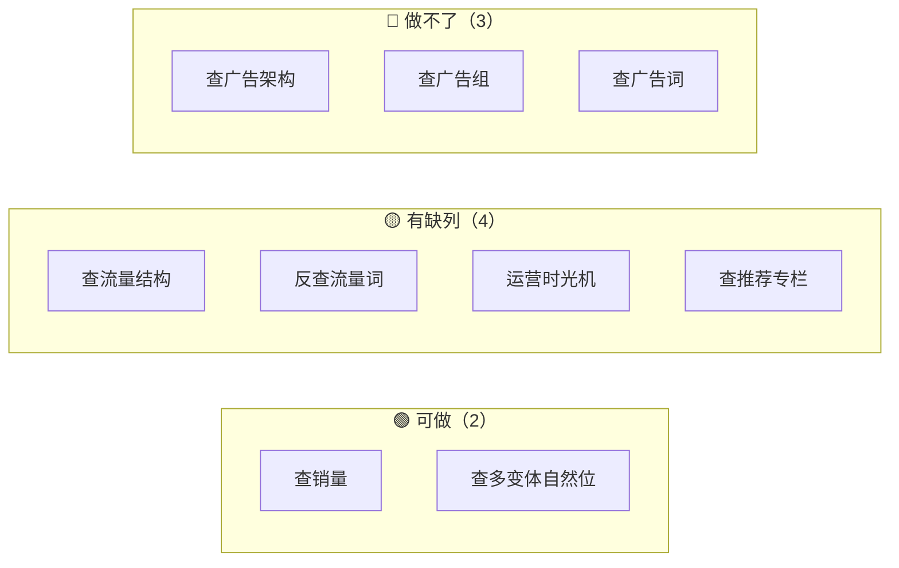

> **2026-09-20 字段级核实后，3 个模块的就绪度被改判**（详见各模块的「改判」说明）：
> 模块 2 🔴→🟢（找到 76,469 行真源）、模块 3 🔴→🟡（专栏名 18→141 个，且钻取表可落）、
> 模块 5 内部 `fact_asin_keyword_score` 🟡→🔴（`channel` 维度确证无源）。

| # | 模块 | 原站路由 | 就绪 | 一句话卡点 |
|---|---|---|---|---|
| 1 | 查销量 | `/Sales` | 🟢 | 分档串 `bought_label` 历史月缺失 |
| 2 | 查多变体自然位 | `/multi-variants` | 🟢 | **改判**：真源是 `sif_asin_keyword.raw->'multiNfInfo'`（76,469 行明细） |
| 3 | 查推荐专栏 | `/recommend` | 🟡 | **改判**：专栏名 141 个（非18），钻取表可落 1,002 行；仅逐日曝光无源 |
| 4 | 查流量结构 | `/search` | 🟡 | 缺 `allSp`/`allSb` 两个聚合渠道 |
| 5 | 反查流量词 | `/reverse` | 🟡 | `keyword_id` 只覆盖 14.9% |
| 6 | 运营时光机 | `/timemachine-traffic` | 🟡 | 运营事件需自行 diff 生成 |
| 7 | 查广告架构 | `/adxray-structure` | 🔴 | 广告活动属性全无源 |
| 8 | 查广告组 | `/adxray-adgroup` | 🔴 | 同上 |
| 9 | 查广告词 | `/adxray-searchterm` | 🔴 | 搜索词曝光表无数据 |

---

## 模块 1 · 查销量 🟢

对应截图的当前页面：上方月销量趋势图 + 下方同组变体列表。

```mermaid
flowchart TD
    P["查销量<br/>/Sales"]

    P --> S1["列表查询SQL1<br/>变体列表"]
    P --> S2["列表查询SQL2<br/>月销量趋势"]
    P --> S3["列表查询SQL3<br/>近30天销量分档"]

    S1 --> T1[("rel_asin_variant")]
    S1 --> T2[("dim_asin")]
    S1 --> T3[("dim_asin_feature")]

    S2 --> T4[("fact_asin_bought_monthly")]

    S3 --> T2
    S3 --> T4

    %% ---------- PG 源层 ----------
    T1 -.->|"解析 variants[]"| G1["sif_api_log<br/>ep=web-asin-variants<br/>387条 ok"]
    T2 -.->|"直接映射"| G2[("sif_asin_meta<br/>6,767行")]
    T3 -.->|"展开 features JSONB"| G3[("sif_asin_sales_monthly<br/>features 650,962行")]
    T4 -.->|"直接映射"| G3

    style G1 fill:#4a2a2a,stroke:#c66
    style G2 fill:#2a3a4a,stroke:#69c
    style G3 fill:#2a3a4a,stroke:#69c
```

> 图中 PG 源层：**蓝色**=已结构化表（直接 SELECT 即可），**红色**=仅存于 `sif_api_log.resp` 原始 JSON（ETL 需先解析）。

| SQL | 用途 | 打的表 | 就绪 | 说明 |
|---|---|---|---|---|
| SQL1 | 变体列表（图片/ASIN/价格/Size） | `rel_asin_variant` + `dim_asin` + `dim_asin_feature` | 🟡 | `brand`/`brand_href`/`first_available_day` 需解析 `sif_api_log`[ep=`web-sales-keyword`]（41.6% 可得，且 09-16 后新抓的基本全有） |
| SQL2 | 月销量趋势迷你图 | `fact_asin_bought_monthly` | 🟢 | 768,319 行，2023-05~2026-08 |
| SQL3 | 子体近 30 天销量 | `dim_asin.bought_past_month` | 🟡 | 分档串被洗成纯数字（`50` 而非 `50+`） |

**已验证的 SQL**：见 [sql/variant_sales_list.sql](sql/variant_sales_list.sql)，在 Doris 实测跑通（6 行变体 + 40 点趋势）。

**PG → Doris 字段级映射**

### `dim_asin` ← 表 `sif_asin_meta` + `sif_api_log`[`endpoint='web-sales-keyword'`]

| Doris 列 | 类型 | PG 来源 | 方式 | 实测填充率 |
|---|---|---|---|---|
| `asin` | varchar | `sif_asin_meta.asin` | ✅ 直接 | 100% |
| `country` | varchar | `sif_asin_meta.site` | ⚙️ upper | 100% |
| `title` | varchar | `.title` | ✅ 直接 | 93.9% |
| `img` | varchar | `.img` | ✅ 直接 | 93.9% |
| `price` | decimal | `.price` | ✅ 直接 | 93.9% |
| `score` | double | `.score` | ✅ 直接 | 89.2% |
| `star` | double | `.star` | ✅ 直接 | 89.2% |
| `rating_num` | bigint | `.rating_num` | ✅ 直接 | 89.2% |
| **`brand`** | varchar | 🟡 `sif_api_log`[ep=`web-sales-keyword`] → `resp.data.asins[].brand` | 解析 JSON | **41.6%**（20,542/49,405 元素） |
| **`brand_href`** | varchar | 🟡 同上 `.brandHref` | 解析 JSON | **40.6%** |
| **`first_available_day`** | date | 🟡 同上 `.firstAvailableDay` | 解析 JSON，格式已是 `YYYY-MM-DD` | **40.8%** |
| **`data_updated_at`** | datetime | 🟡 同上 `.snapshotUpdateTime` | 解析 JSON | **41.1%** |
| **`seller`** | varchar | 🟡 `sif_asin_traffic_daily.buybox_seller` | 取最新一天 | **86.2%** |
| **`is_parent_asin`** | tinyint | 🟡 `sif_api_log`[ep=`web-sales-asin`] → `resp.data.isParentAsin` | 解析 JSON | 639 条响应，**仅 4 条为 true** |
| `parent_asin` | varchar | ⚙️ 由 `rel_asin_variant` 反向推导 | 见下 | — |
| **`is_best_seller`** | tinyint | 🟡 **改判：有源** `sif_api_log`[ep=`web-asin-variants`] → `resp.data.variants[].isBestSeller` | 解析 JSON | **11,164/12,988 非空（86.0%）**，覆盖 10,866 ASIN，其中 597 个为 true |
| `created_at`/`updated_at` | datetime | ⚙️ ETL 写入时间 | `now()` | — |

> ## ⏰ 41% 不是稀疏，是上游 2026-09-16 才加的新字段（按天实测）
>
> `brand`/`brandHref`/`firstAvailableDay`/`snapshotUpdateTime` 的填充率随日期**突变**，逐日统计：
>
> | 抓取日 | 响应行数 | 含 brand 的行 |
> |---|---:|---:|
> | 2026-08-10 ~ 09-15（26 天累计） | 1,239 | **0** |
> | **2026-09-16** | 419 | **55** |
> | 2026-09-17 | 406 | **354** |
> | 2026-09-18 | 291 | 209 |
> | 2026-09-19 | 82 | 61 |
> | 2026-09-20 | 42 | 32 |
>
> **含义**：09-16 之前抓的数据永久没有 brand，之后抓的基本都有（09-17 起 87%）。
> 所以**重抓一遍就能把 brand 覆盖率从 41% 提到接近 100%**，不需要另找数据源。
> 这也意味着 41% 这个数字会随时间自动上升，ETL 不必为此设计补偿逻辑。

> ⚠️ **修正此前的判断**：ETL_GAP_ANALYSIS §3.1 记录「`brand`/`brand_href`/`first_available_day` 全库 0%」。
> 那个结论只查了 `asin-basic-info` 与 `web-sales-asin` 两个接口。**实测 `web-sales-keyword` 有这些字段**
> （48,975 行 asins[]，brand 填充 41%，样例 `10 Strawberry Street` + 店铺链接，是真实值不是占位）。
> 这是 31 个未解析 endpoint 里**信息量最大的一个**，建议提到 P0 优先解析。
> 注意：它与 `sif_asin_meta` 的 ASIN 交集只有 302 个，**它的价值是扩充 ASIN 池而非补全现有 ASIN**。

> ## 🔄 ASIN 池只用了 12%（JSON 深挖新发现）
>
> `dim_asin` 目前只从 `sif_asin_meta`（**6,759** 个 ASIN）取数，但全域 ASIN 并集是 **54,578** 个：
>
> | 源 | distinct ASIN |
> |---|---:|
> | `sif_asin_sales_monthly` | **38,054** 🥇 |
> | `sif_asin_meta`（现 `dim_asin` 唯一源） | 6,759 |
> | **`sif_asin_meta.raw->'listing'->'asins[]'`**（被丢弃） | **14,533**，其中 **7,926 个 meta 表里没有** |
> | `sif_asin_keyword.raw->'multiNfInfo'` 变体 | 5,434 |
> | `sif_asin_keyword` | 4,785 |
> | `sif_asin_traffic_daily` | 2,374 |
> | **全域并集** | **54,578** |
>
> **这解释了此前测到的 2.5% JOIN 命中率**——不是数据没抓到，是 `dim_asin` 的源选窄了。
> 只要把 `sales_monthly` 的 ASIN 也灌进 `dim_asin`（即使只有 asin+country 两列），
> 模块 1 的销量榜 JOIN 命中率就能从 2.5% 大幅提升。
>
> **另一个被整块丢弃的结构**：`sif_asin_meta.raw->'listing'->'asins[]'` 有 **17,723 行变体级数据**，
> 爬虫落库时只保留了「被查 ASIN 自身」那一行（6,597 行），**丢掉 11,126 行**。里面有：
>
> | 字段 | 填充率 | 可喂 |
> |---|---:|---|
> | `total`/`natural`/`ad`/`sp`/`spRec`/`rec`/`brand`/`brandVedio`/`vedio` 9 个计数 | **100%** | `fact_asin_keyword_overview`（变体级，比现有平铺列多 **2.7 倍**） |
> | `ac` | 93.7% | 同上 |
> | `features[]` | 16,296 行 | ⚠️ **裸字符串无维度名**，填不了 `feature_name`（同 `web-asin-variants` 的局限） |

### `dim_asin_feature` ← 表 `sif_asin_sales_monthly.features`

| Doris 列 | 类型 | PG 来源 | 方式 | 实测 |
|---|---|---|---|---|
| `asin` | varchar | `.asin` | ✅ 直接 | 100% |
| `country` | varchar | `.site` | ⚙️ upper | 100% |
| `feature_name` | varchar | `features[].code` | ⚙️ 展开 JSONB | 650,962 行非空 |
| `feature_value` | varchar | `features[].value` | ⚙️ 展开 JSONB | 同上 |
| `created_at` | datetime | ⚙️ `now()` | — | — |

> **三个候选源只有这个能用**：它是唯一**自带维度名**的（`{"code":"Size","value":"Set of 2"}`），覆盖 29,501 个 ASIN。
> `web-asin-variants.features` 只有裸值 `['Small','Coffee']` **没有维度名**，填不了 `feature_name`；
> `listing-summary.features` 同样缺维度名且只覆盖 881 个 ASIN。
> ⚠️ ER 文档注释说「需按下标 zip 对齐父子 features」，**实测 PG 数据已 zip 好**，无需对齐。

### `fact_asin_bought_monthly` ← 表 `sif_asin_sales_monthly`

| Doris 列 | 类型 | PG 来源 | 方式 | 实测 |
|---|---|---|---|---|
| `asin` | varchar | `.asin` | ✅ 直接 | 100% |
| `country` | varchar | `.site` | ⚙️ upper | 100% |
| `stat_month` | varchar | `.period` | ✅ 直接（已是 `YYYY-MM`） | 100% |
| `bought_lower_bound` | bigint | `.bought_num` | ✅ 直接 | 100% |
| **`bought_label`** | varchar | 🔴 历史月无源 | 仅当月可从 `sif_asin_meta.bought_past_month` 回填 | 40.2% 且**格式已被洗成纯数字** |
| `created_at` | datetime | ⚙️ `now()` | — | — |

### `rel_asin_variant` ← `sif_api_log`[`endpoint='web-asin-variants'`]

| Doris 列 | 类型 | PG 来源（JSON 路径） | 方式 | 实测 |
|---|---|---|---|---|
| `parent_asin` | varchar | `params->>'asin'`（请求参数） | ⚙️ 取入参 | 387 条 ok |
| `child_asin` | varchar | `data.variants[].asin` | ⚙️ 解析，排除空串 | 10,828 distinct |
| `country` | varchar | `sif_api_log.site` | ⚙️ upper | 100% |
| `display_order` | int | `data.variants[].order` | ⚙️ 解析 | 100% |
| `ratio` | double | `data.variants[].ratio` | ⚙️ 解析 | 100% |
| `created_at` | datetime | ⚙️ `now()` | — | — |

> `order=0` 且 `asin=''` 的是 Listing 汇总行，ETL 要过滤。
> `dim_asin.parent_asin` 可由本表反查填充。

**三个实施要点**
1. `dim_asin_feature` 一个属性一行，**必须先子查询聚合再 JOIN**，否则变体行翻倍
2. `fact_asin_bought_monthly` 的 `bought_lower_bound` 直接取 PG 的 `bought_num`；ETL 前**须按 `(asin, period)` 去重**——PG 侧汇总行与具名变体行值重复，实测虚高 37,400 件
3. `display_order = 0` 是 Listing 汇总行，列表要过滤

---

## 模块 2 · 查多变体自然位 🟢（结论已改判）

```mermaid
flowchart TD
    P["查多变体自然位<br/>/multi-variants"]

    P --> S1["列表查询SQL1<br/>逐日占位趋势"]
    P --> S2["列表查询SQL2<br/>关键词区间聚合"]
    P --> S3["列表查询SQL3<br/>变体排名明细弹层"]

    S1 --> T1[("fact_asin_multinf_daily")]
    S2 --> T2[("fact_asin_multinf_keyword")]
    S2 --> T3[("dim_keyword")]
    S3 --> T4[("fact_asin_multinf_keyword_variant")]
    S3 --> T5[("rel_asin_variant")]

    %% ---------- PG 源层 ----------
    T1 -.->|"A路: dates/asinCntList 仅21ASIN"| G1["sif_api_log<br/>ep=web-asin-day-trend<br/>26 条"]
    T1 -.->|"B路: 聚合 1797 ASIN"| GM["sif_asin_keyword.raw<br/>-&gt;multiNfInfo<br/>76,469行明细"]
    T2 -.->|"聚合 avg_rank/appear_days"| GM
    T3 -.->|"keyword_id 100%"| G2[("sif_asin_keyword<br/>18,331行")]
    T4 -.->|"展开 dateAsins[].asins[]"| GM
    T5 -.->|"解析 variants[]"| G3["sif_api_log<br/>ep=web-asin-variants<br/>387条 ok"]

    style GM fill:#2a4a2a,stroke:#6c6
    style G1 fill:#4a2a2a,stroke:#c66
    style G3 fill:#4a2a2a,stroke:#c66
    style G2 fill:#2a3a4a,stroke:#69c
```

> 🟩 **绿色节点 `multiNfInfo` 是本次核实的最大发现**——它藏在 `asin-keyword-list` 每个词条下面，
> 按 endpoint 名搜索找不到，导致我最初误判整个模块无源。

> ## 🔄 本模块结论已推翻，改判为 🟢
>
> 我此前判定「三张多变体表全无数据源」。**这是错的。**
> 真源藏在 `asin-keyword-list` 的 `multiNfInfo` 里——它不是独立 endpoint，而是**挂在关键词列表每个词条下面的嵌套结构**，所以按 endpoint 名搜索找不到。
>
> 已独立复核（三项实测）：
> - 含 `multiNfInfo` 的响应：**6,322 条**
> - 展开 `dateAsins[].asins[]` 后：**76,469 行明细**（比 `web-asin-day-trend` 的 26 条大 **2,941 倍**）
> - 覆盖：**5,453 个变体 ASIN × 2,770 个关键词**，日期 2026-07-30 ~ 2026-09-18，6 个站点
>
> 明细元素结构（实测）：
> ```json
> {"asin":"B0CRTNBCS6","date":"2026-09-11","rank":1,"pageNum":1,
>  "pageRank":1,"pageSize":48,"img":"https://...","features":["16PCS 12 Color mixing"]}
> ```

**PG → Doris 字段级映射**

### `fact_asin_multinf_keyword_variant` ← `sif_api_log`[`endpoint='asin-keyword-list'`] → `resp.data.list[].multiNfInfo`（数据最厚）

> 也可走已结构化表 `sif_asin_keyword.raw->'multiNfInfo'`（同一份数据，已落库，**推荐用这个**，省一层 JSON 解析）。

| Doris 列 | 类型 | PG 来源（JSON 路径） | 方式 | 实测 |
|---|---|---|---|---|
| `parent_asin` | varchar | `params->>'asin'` | ⚙️ 取入参 | 1,797 个 ASIN |
| `country` | varchar | `sif_api_log.site` | ⚙️ upper | 6 站点 |
| `keyword_id` | bigint | `list[].keywordId` | ✅ 直接 | **2,770，无需反查** |
| `variant_asin` | varchar | `…dateAsins[].asins[].asin` | ✅ 直接 | **5,453 distinct** |
| `time_piece_type` | varchar | ⚙️ 常量 `'month'` | 派生 | — |
| `time_piece_value` | varchar | `to_char(date,'YYYY-MM')` | ⚙️ 派生 | 3 个月 |
| `rank_position` | int | `asins[].rank` | ✅ 直接 | **76,469 条明细** |
| `variant_role` | varchar | 🔴 **确证无源**（搜 `variantRole` 0 命中） | 可按 rank 最小=主变体推导 | 0% |

**可落 14,694 行**（distinct parent×kwId×month×variant）。

> **`asins[]` 元素还有 4 个字段本表无承接列**（keyset 100% 一致，实测无类型漂移）：
>
> | 字段 | 说明 | 建议 |
> |---|---|---|
> | `features[]` | **第四层嵌套**，91,076 个变体属性值字符串（如 `"Zinc"`） | 裸值无维度名，只能做展示不能填 `feature_name` |
> | `img` | 变体主图 | 加列，前端列表要用 |
> | `pageNum` / `pageRank` / `pageSize` | 页码/页内位/页容量 | 加列，否则只有全局 `rank` 无法还原「第几页第几位」 |
>
> ⚠️ 注意别混淆两层同名字段：`dateAsins[].pageNum` **19,223 个元素全为 NULL**，
> 而子层 `dateAsins[].asins[].pageNum` **100% 有值**。取错层会得到空列。

### `fact_asin_multinf_keyword` ← 同源聚合

| Doris 列 | PG 来源 | 方式 | 实测 |
|---|---|---|---|
| `asin`/`country`/`keyword_id` | 同上 | ✅ 直接 | 100% |
| `avg_rank` | `avg(asins[].rank)` | ⚙️ **需自算**（搜 `avgRank` 0 命中） | 4,325 行 |
| `appear_days` | `count(distinct date)` | ⚙️ **需自算** | 4,325 行 |
| `asin_cnt` | `count(distinct asins[].asin)` | ⚙️ 需自算 | 4,325 行 |

**可落 4,325 行**。4 个指标列全是 ETL 自算，非站点原值。

### `fact_asin_multinf_daily` ← 两路源，需决策（A/B 均为 `sif_api_log` 的不同 endpoint）

| Doris 列 | 源 A：`sif_api_log`[ep=`web-asin-day-trend`]（21 ASIN） | 源 B：`sif_asin_keyword.raw->'multiNfInfo'` 聚合（1,797 ASIN） |
|---|---|---|
| `stat_date` | `data.dates[]` | `dateAsins[].date` ✅ **推荐** |
| `asin_cnt` | `asinCntList[].value`（**抽样全为 0**） | `count(distinct asin)` ✅ |
| `keyword_cnt` | `keywordCntList[].value`（同为 0） | `count(distinct keywordId)` ✅ |
| `score` | `scoreList[].value` 🟡 | ❌ 无 |
| **`extra_score`** | `extraScoreList[].value` 🟡 | ❌ **唯一源** |
| **`listing_asin_cnt`** | `data.listingAsinCnt` 🟡 | ❌ **唯一源** |

> ⚠️ **两路混用会导致同一张表两个口径**，需决策：
> 走 B 能覆盖 1,797 个 ASIN 但缺 `extra_score`/`listing_asin_cnt`；
> 走 A 六列全覆盖但**只有 21 个 ASIN / 745 个 (asin,date) 对**。

### `rel_asin_variant`
复用模块 1 的 ETL（`web-asin-variants`，387 条 ok）。

| SQL | 打的表 | 就绪 | 说明 |
|---|---|---|---|
| SQL1 | `fact_asin_multinf_daily` | 🟡 | 两路源需决策：B 路覆盖 1,797 ASIN 但缺 2 列，A 路全覆盖仅 21 ASIN |
| SQL2 | `fact_asin_multinf_keyword` + `dim_keyword` | 🟢 | 可落 4,325 行，但 4 个指标列需 ETL 自算 |
| SQL3 | `fact_asin_multinf_keyword_variant` | 🟢 | **可落 14,694 行**，仅 `variant_role` 无源 |

---

## 模块 3 · 查推荐专栏 🟡（结论已改判）

```mermaid
flowchart TD
  P["查推荐专栏<br/>/recommend"]

    P --> S1["列表查询SQL1<br/>专栏字典"]
    P --> S2["列表查询SQL2<br/>逐日曝光占比"]
    P --> S3["列表查询SQL3<br/>专栏→活动→词 钻取"]

    S1 --> T1[("dim_recommend_column")]
    S2 --> T2[("fact_asin_rec_column_period")]
    S3 --> T3[("rel_rec_column_campaign_keyword")]
    S3 --> T4[("dim_ad_campaign")]
    S3 --> T5[("dim_keyword")]

    %% ---------- PG 源层 ----------
    T1 -.->|"四源并集取对象键"| G1["raw.allRankHistory.recRanks 119<br/>+ flow-overview 33 + rank-history 25<br/>+ change_reasons 15 = 并集 141"]
    T2 -.->|"❌ 无逐日曝光数据"| GX1["无源"]
    T3 -.->|"❌ 无三层钻取关系"| GX2["无源"]
    T4 -.->|"仅 ID 无属性"| G2["sif_api_log<br/>ep=web-variant-ad-keywords<br/>13条 ok（11.8%）"]
    T5 -.->|"keyword_id 仅 14.9%"| G3[("sif_asin_keyword")]

    style G1 fill:#4a2a2a,stroke:#c66
    style G2 fill:#4a2a2a,stroke:#c66
    style G3 fill:#2a3a4a,stroke:#69c
    style GX1 fill:#3a3a3a,stroke:#888
    style GX2 fill:#3a3a3a,stroke:#888
```

**PG → Doris 字段级映射**

### `dim_recommend_column` — 专栏名实测 **141 个**（四源并集）

| Doris 列 | 类型 | PG 来源 | 方式 | 实测 |
|---|---|---|---|---|
| `rec_title` | varchar | **四源并集**（见下表） | ⚙️ 取对象键 | **并集 141 distinct** |
| `country` | varchar | `sif_api_log.site` | ⚙️ upper | US 为主 |
| `short_code` | varchar | 🔴 **确证无源**（搜 `shortCode` 0 命中） | 需自建映射 | 0% |
| `display_name_cn` | varchar | 🔴 **确证无源** | 需自造 | 0%（`wholeName` 实测 33/33 等于英文原文） |
| `first_seen_at`/`last_seen_at` | datetime | `min/max(fetched_at)` | ⚙️ 按 rec_title 聚合 | 40 行 |

**四个专栏名源的实测量**（我此前只找到 18 个，实际大得多）：

| 源 | distinct 专栏名 | 说明 |
|---|---:|---|
| `sif_asin_keyword.raw->'allRankHistory'->'recRanks'` 对象键 | **119** | 🥇 **主力源**，已结构化落地 |
| `web-asin-flow-overview.data.recommend` 键 | 33 | 带 `ratio`/`score` |
| `asin-keyword-rank-history.data.recSpRankHistories` 键 | 25 | 时间跨度最长 |
| `sif_asin_traffic_change.change_reasons[].recTitle` | 15 | 我最初唯一找到的源 |
| **全域并集** | **141** | |

> ⚠️ **数字修正过三轮**：18 → 40 → **141**。根因是我最初只查了 `change_reasons` 一处（15 个），
> 漏了已落地的 `raw->'allRankHistory'->'recRanks'`——它单独就有 **119 个**。
>
> **这是开放集合**，除 ~14 个高频通用专栏（`Customers frequently viewed` 6,511 次、
> `4 stars and above` 2,615 次、`Seen on social media` 2,346 次）外，
> 其余是 `Shop/Explore/Discover/Find/Browse + <类目词>` 的**长尾类目模板**，会随类目无限增长。
> 印证了 ER 文档「按动态实体 upsert」的设计是对的。
>
> ⚠️ **141 里约 10 个是同一专栏的多语言变体，ETL 需归一**（实测 6 个含非 ASCII 字符 +
> 若干纯 ASCII 的德文名）：`Von Kunden häufig angesehen`(131)、`Auswahl aus sozialen Medien`(177)、
> `Hoch bewertet`(101)、`Fréquemment consulté par les clients`(10)、`Choix sur les réseaux sociaux`(1) 等，
> 分别对应 `Customers frequently viewed` / `Seen on social media` / `Highly rated` 的 DE/FR 版本。
>
> `short_code` 的 9 个枚举**只能覆盖高频的十几个，其余全归 `other`**。

### `rel_rec_column_campaign_keyword` — 🟢 **本域唯一能完整落地的表，5 列全有源**

| Doris 列 | 类型 | PG 来源 | 方式 | 实测 |
|---|---|---|---|---|
| `asin` | varchar | `params->>'asin'` | ⚙️ 取入参 | 83 |
| `country` | varchar | `site` | ⚙️ upper | US |
| `rec_title` | varchar | `recRanks[]` 对象键 | ⚙️ 取键 | 30 |
| `keyword_id` | bigint | `suggestList[].keywordId` | ✅ 直接 | **403，填充 100%** |
| `encrypt_campaign_id` | varchar | `recRanks[].<title>.campaignId` | ⚙️ 解析 | 217 |

**可落 1,002 行**。元素结构：`{"Customers frequently viewed": {"campaignId": "A0877...", "maskCampaignId": "UNJY"}}`
——同元素的 `maskCampaignId`(217) 还能回填 `dim_ad_campaign.fake_campaign_id`。

### `fact_asin_rec_column_period` — 🔴 3 列无源

| Doris 列 | PG 来源 | 状态 | 实测 |
|---|---|---|---|
| `asin`/`country` | `flow-overview` params | ✅ | 84 ASIN，2 站点 |
| `rec_title` | `data.recommend` 键名 | 🟡 | 33 |
| `ratio` | `data.recommend.<title>.ratio` | 🟡 | **214 个 (asin,recTitle) 对** |
| **`stat_date`** | 🔴 **flow-overview 是区间聚合无日期维度** | 只能退化用 `fetched_at::date` | 0% |
| **`campaign_cnt`** | 🔴 确证无源 | — | 0% |
| **`keyword_cnt`** | 🔴 确证无源 | — | 0% |

> `data.recommend.<title>` 实测只有 4 个键（`name`/`wholeName`/`ratio`/`score`），无计数无日期。
> 顺带：`score` 有值但 Doris 没这一列，被丢了。

> ⚠️ **上表的「无源」结论已被 2026-09-22 的换源推翻（本节其余内容是 PG 视角，保留作历史）。**
> `ratio` 现已由 sif-mcp `ops_get_listing_traffic_overview` 灌入（见 `scripts/sif_load_rec_column.mjs`），
> 且响应带 `data_notice` 提供真实日期，`stat_date` 不必再退化用 `fetched_at`。
> `campaign_cnt` / `keyword_cnt` 改由下面这张新表承载。

### `fact_rec_column_trend` ← 原站 `POST /api/search/rec/recView`（🟢 新建，schema-09）

**不走 PG** —— PG 侧算不出（`allRankHistory.recRanks` 只记「某天该专栏出现了、由哪个活动带来」，
拿不到「该专栏当天关联了多少活动/多少词」，那是跨该 ASIN 全部关键词去重后的计数）。
换成原站服务端已算好的 `rec/recView`。

| Doris 列 | 源字段 | 说明 |
|---|---|---|
| `campaign_cnt` / `keyword_cnt` | `campaignCntTrends` / `keywordCntTrends` 按天拆行 | ⚠️ **数组里的 null 是「当天该专栏无曝光」不是 0**，画图要断线；补 0 会画成贴底的线，读起来像「有数据但为 0」 |
| `last_campaign_cnt` / `last_keyword_cnt` | `lastCampaignCnt` / `lastKeywordCnt` | ⚠️ **行尾数字用这两列，不要取趋势数组末位** —— 实测 `Picks from Amazon Influencers` 的数组末位是 null 而 `lastCampaignCnt=1` |
| `window_days` / `window_start` / `window_end` | `totalDays` 等 | 窗口信息每行重复存，免得单表查询还要关联窗口表 |

> ⚠️ **采集必须由主会话在已登录浏览器里导航并捕获响应** ——
> `_m` 参数按请求现签，手工重放会拿 404（见 `scripts/load_rec_column_trend.mjs` 的说明）。
> 消费方：`apps/api/src/business/insights.service.ts`（`getRecommendColumns`）。
>
> ⚠️ schema-09 用的是 `DROP TABLE IF EXISTS` + 裸 `CREATE`（不是 `CREATE TABLE IF NOT EXISTS`），
> **重跑会清空已灌数据**，而它现在被 `setup-doris.sh` 的 `SCHEMA_FILES` 无条件执行。
> 新建表请勿照抄这一点。

| SQL | 打的表 | 就绪 | 说明 |
|---|---|---|---|
| SQL1 | `dim_recommend_column` | 🟢 | **改判**：实测 **141 个**专栏名（非 18），可直接初始化 |
| SQL2 | `fact_asin_rec_column_period` | 🟢 | **二次改判（2026-09-22 换源）**：`ratio` 与 `stat_date` 已由 sif-mcp 灌入；计数列移交 `fact_rec_column_trend` |
| SQL3 | `rel_rec_column_campaign_keyword` | 🟢 | **改判**：5 列全有源，**可落 1,002 行**，`keyword_id` 填充 100% |
| SQL4 | `fact_rec_column_trend` | 🟢 | **新增（schema-09）**：按天活动数/词数，源 `rec/recView`。PG 侧算不出，见上方小节 |

**其中 18 个（早期只从 `changeReasons[].recTitle` 提取到的子集，完整是 141 个）**：

```
4 stars and above      Picks from Amazon Influencers
Browse Portable Solutions       Recently bought and rated
Customers frequently viewed     Seen on social media
Explore Facial Care Essentials  Shop Party Beauty Essentials
Explore Sleeveless Styles       Shop sweater tank tops by style
Find Wedding Home Goods     Today's deals
Inspired by similar searches    Today's deals from Amazon Devices
New arrivals  Trending now
Other items to consider      Trending styles
```

> ⚠️ 上面只是 `changeReasons` 一处的 15 个。**并入 `recRanks`(119)、`flow-overview`(33)、`rank-history`(25) 后实测共 141 个**，详见下方字段级映射。

---

## 模块 4 · 查流量结构 🟡

```mermaid
flowchart TD
    P["查流量结构<br/>/search"]

    P --> S1["列表查询SQL1<br/>分渠道流量占比"]
    P --> S2["列表查询SQL2<br/>Listing 指标趋势"]
    P --> S3["列表查询SQL3<br/>子类目 BSR"]
    P --> S4["列表查询SQL4<br/>渠道关键词计数"]

    S1 --> T1[("fact_asin_traffic_channel")]
    S1 --> T2[("dict_traffic_channel")]
    S2 --> T3[("fact_asin_listing_snapshot")]
    S3 --> T4[("fact_asin_subbsr_snapshot")]
    S4 --> T5[("fact_asin_keyword_overview")]

    %% ---------- PG 源层 ----------
    T1 -.->|"7列宽表→长表<br/>缺 allSp/allSb"| G1[("sif_asin_traffic_daily<br/>1,573,941行")]
    T2 -.->|"人工初始化"| GD["字典，非 ETL"]
    T3 -.->|"price/star/review/bsr"| G1
    T4 -.->|"展开 sub_bsr JSONB"| G1
    T5 -.->|"解析 8个 *KeywordCnt"| G2["sif_api_log<br/>ep=web-asin-keyword-overview<br/>424条 ok（75.3%）"]

    style G1 fill:#2a3a4a,stroke:#69c
    style G2 fill:#4a2a2a,stroke:#c66
    style GD fill:#3a3a2a,stroke:#cc6
```

**PG → Doris 字段级映射**

### `fact_asin_traffic_channel` ← 表 `sif_asin_traffic_daily`（宽表转长表）

| Doris 列 | 类型 | PG 来源 | 方式 | 实测填充率 |
|---|---|---|---|---|
| `asin` | varchar(16) | `.asin` | ✅ 直接 | 100% |
| `country` | varchar(8) | `.site` | ⚙️ upper | 100%（仅 US/DE/UK 有数） |
| `time_piece_type` | varchar(16) | — | ⚙️ 常量 `'month'` | **`week` 无源** |
| `time_piece_value` | varchar(32) | `.stat_date` | ⚙️ `to_char(stat_date,'YYYY-MM')` | 聚合后 53,904 个组合 |
| `channel` | varchar(16) | 7 个 `*_score` 列名 | ⚙️ 列名→枚举（见下） | 见下 |
| `score` | double | 对应 `*_score` | ⚙️ 月内聚合 + numeric→double | 见下 |
| `score_ratio` | double | — | ⚙️ `score/total_score` 现算 | 66.48%（受分母限制） |
| `score_change` | double | 🔴 **无源** | Doris 侧相邻月 LAG 自算 | 0% |
| `score_change_ratio` | double | 🟡 `sif_asin_traffic_change_score` | 弱源，**日粒度与月不匹配** | 仅 418 行 |
| `contri_change_ratio` | double | 🔴 **无源** | PG 的同名列是**关键词级**不是渠道级 | 0% |

**channel 枚举核实**（Doris 字典定义 **12 个**，不是我此前说的 9 个）：

| Doris code | PG 源列 | 实测填充率 | 结论 |
|---|---|---:|---|
| `total` | `total_score` | 66.48% | ✅ |
| `nf` | `nf_score` | 64.27% | ✅ |
| `ad` | `ad_score` | 39.70% | ✅ |
| `sp` | `sp_score` | 31.04% | ✅ |
| `spRec` | `rec_sp_score` | 25.00% | ✅ **注意改名** |
| `sb` | `sb_score` | 6.83% | ✅ |
| `sbv` | `sbv_score` | 8.50% | ✅ |
| `allSp` | 🟡 **有直接源**：`web-asin-keyword-overview.allSpKeywordCnt` | 405/405 = **100%** | 无需加总派生 |
| `allSb` | 🟡 **有直接源**：`…allSbKeywordCnt` | 405/405 = **100%** | 无需加总派生 |
| **`ac`** | 🔴 | 0% | 上游不吐（`acScore` 全库 0 命中） |
| **`bs`** | 🔴 | 0% | `bsScore` 全库 0 命中 |
| **`deal`** | 🔴 | 0% | `dealScore` 全库 0 命中 |

> ⚠️ **不要用加总派生 `allSp`/`allSb`**：实测 `ad ≈ sp+recSp+sb+sbv` 只在 **83.6%** 行成立，
> `total ≈ nf+ad` 只在 **76.5%** 行成立，上游分渠道分数**并非严格可加**，加总会有 17~24% 偏差。
> 而 `web-asin-keyword-overview` 直接给了 `allSpKeywordCnt`/`allSbKeywordCnt`（405/405 = 100%），**应优先取直接源**。
> 注意它给的是**关键词计数**不是流量得分——若 `fact_asin_traffic_channel.score` 需要得分，
> 则 `allSp`/`allSb` 的得分仍无源，只能落计数到 `fact_asin_keyword_overview`。

### `fact_asin_listing_snapshot` ← 表 `sif_asin_traffic_daily`（本表无无源列）

| Doris 列 | 类型 | PG 来源 | 方式 | 实测填充率 |
|---|---|---|---|---|
| `asin` / `country` | varchar | `.asin` / `.site` | ✅ 直接 | 100% |
| `stat_month` | varchar(7) | `.stat_date` | ⚙️ `to_char(...,'YYYY-MM')` | 100% |
| `price` | decimal(12,2) | **`.buybox_price`** | ⚙️ 月聚合 | 日级 86.1%，月级 89.6% |
| `score` | double | **`.star`** | ✅ 直接 | 日级 88.8%，月级 89.0% |
| `rating_num` | bigint | **`.review`** | ✅ 直接 | 日级 88.8%，月级 89.0% |
| `bsr` | bigint | `.bsr` | ✅ 直接 | 日级 84.8%，月级 86.0% |

> **三处列名不对应，容易写错**：Doris `score` ← PG **`star`**；Doris `rating_num` ← PG **`review`**；Doris `price` ← PG **`buybox_price`**。
> `price` 有 4 个候选源，**`ld_price` 实测 0% 整列为空**，直接弃用。
> **聚合口径**：`rating_num` 是累计评价数，**取月均在业务上是错的**，应取月内最后一个非空日。

### `fact_asin_subbsr_snapshot` ← 表 `sif_asin_traffic_daily.sub_bsr`（本表无无源列）

`sub_bsr` 实测是**单层扁平对象** `{"Bracelets": 248}`，100% 是 object、value 100% 是整数。

| Doris 列 | 类型 | PG 来源 | 方式 | 实测 |
|---|---|---|---|---|
| `asin` / `country` | varchar | `.asin` / `.site` | ✅ 直接 | 100% |
| `cat_name` | varchar(255) | `jsonb_each(sub_bsr).key` | ⚙️ JSONB key 展开 | 1,183 个 distinct，最长 44 字符 |
| `stat_date` | date | `.stat_date` | ✅ 直接 | **本表是日粒度，无需月聚合** |
| `bsr` | bigint | `jsonb_each(sub_bsr).value` | ⚙️ → bigint | 全整数无需容错 |

```sql
SELECT site AS country, asin, kv.key AS cat_name, stat_date, (kv.value)::bigint AS bsr
FROM sif_asin_traffic_daily, jsonb_each(sub_bsr) AS kv
WHERE sub_bsr IS NOT NULL
```

> 展开后 **1,607,417 行，主键组合完全唯一，无需去重**。
> 有 **63,021 行** `sub_bsr` 有值但主表 `bsr` 为 NULL——两者独立，别用主 `bsr` 做过滤。
> `cat_name` 上游有截断脏值（`Toys & Game`、`Home & Kitche` 被砍尾），**保持原样不要修**，否则与上游对不上。
>
> ⚠️ **本表只有小类 BSR**。上游 `sub_bsr` 就是小类字典，**大类 BSR（`bsr` 列）在这条链路上没有落表**，
> 原站因果图的 BSR 双倒置轴要两条线，此前只能画出一条。
> 大类已由 `fact_asin_daily_snapshot.bsr` 补上（见下），两表的 BSR **不是同一个量，不要混用**。

### `fact_asin_daily_snapshot` ← `sif-cli` `traffic-trend[granularity=day]`（🟢 新建，2026-09-23）

**不走 PG**，源是 sif-cli 网关。一次调用返回 **356 天 × 37 字段**，覆盖原站 60 天复合图与 83 天因果图所需的全部序列。
ETL：`scripts/sif_load_daily_grain.mjs`（主会话落盘 → 脚本解析入库，与 `sif_load_rec_column.mjs` 同模式）。

| Doris 列族 | 源字段 | 实测填充（B01NBNDC1T / 356 天） |
|---|---|---|
| `buybox_price` / `deal_price` | `buyboxPrice` / `dealPrice` | 356/356，12.50~28.50 |
| `ld_price` + `ld_raw` | `ldPrice` | **36/356**。⚠️ 源是复合串 `"14.99_0_当日19:35-次日07:35"`，拆价格 + 存原串 |
| `prime_price` | `primePrice` | 10/356 |
| `total_score` / `nf_score` / `ad_score` | `totalScore.score` 等 | 351/356 |
| `sp_score` / `rec_sp_score` / `sb_score` / `sbv_score` | 同上 `.score` | 348 / 318 / 293 / 279 |
| **`bsr`（大类）** | `bsr[]` | 356/356，9~122，类目 `Home & Kitchen` |
| **`sub_bsr`（小类）** + `sub_bsr_cat` | `subBsr` 字典 | 356/356，恒 1~2，类目 `Pillow Inserts` |
| `star` / `review_num` / `seller_num` | `star` / `review` / `seller` | 356/356 |
| `woot` / `title_img` / `coupon_info` / `promotion` | 同名 | 356 / **14** / **0** / **9** |
| `bought_in_past_month` | `boughtInPastMonth` | 352/356，值 30000（**分档下界非精确值**） |

> **三个易错点**：① 源是「`dates[]` 时间轴 + 等长数组」按**下标对齐**，不是 `{date,value}` 配对；
> ② 流量族是**结构体数组** `{score, scoreRatio, ...}`，要取 `.score`；
> ③ `subBsr` 的键是**动态类目名**，遍历取不要硬编码。
> `titleImg` 是**整数标志位**（实测值 2）不是文本。

### `fact_asin_keyword_attribution` ← `sif-cli` `rvs`（日） + `diag`（月）（🟢 新建，2026-09-23）

回答「这个词变了多少、**为什么**变」。与 `fact_asin_keyword_inout` 语义不同（那张只记进出状态），两表并存。

| Doris 列 | 源（diag / rvs） | 实测 |
|---|---|---|
| `contri_change` | `diffScore` / `contriChange` | 月 300 词（源总计 3,079）、日 10 词 |
| `reason_summary` | 由 `pchangeReason` / `changeReasons[]` 预格式化 | 如「SP(常规)位：5 → 2；SP(推荐)位：2 → 0；SB位：17 → 3」 |
| `change_reasons` | 原文 JSON | 变长结构体数组，拆列会爆所以原样存 |

> ⚠️ 源里有**同义字段对**：`sbInfo` 与 `brandInfo` 值恒相同、`sbvInfo` 与 `vedioInfo` 同理
> （`vedio` 是源侧拼写错误）。不去重会让摘要里同一件事说两遍
> （实测「SB位：17 → 3；品牌位：17 → 3」）。ETL 的 `CH_LABEL` 已只保留一个。

### `fact_asin_keyword_overview` ← `sif_api_log`[`endpoint='web-asin-keyword-overview'`]（🟢 源比预期完整）

实测 **8 个渠道 × 4 个指标全部 405/405 = 100% 非空**（全表聚合）：

| 渠道 key | total | in | out | prev |
|---|---:|---:|---:|---:|
| `nfKeywordCnt` / `adKeywordCnt` / `spKeywordCnt` / `recSpKeywordCnt` | 405 | 405 | 405 | 405 |
| `sbKeywordCnt` / `sbvKeywordCnt` / **`allSpKeywordCnt`** / **`allSbKeywordCnt`** | 405 | 405 | 405 | 405 |

覆盖 372 个 ASIN、30 个时间片（2024-11 ~ 2026-09，含 month 与 day 两种格式）。

> ⚠️ **Doris 表装不下这个结构**：`fact_asin_keyword_overview` 只有 `keyword_cnt` 一列，
> 而源有 `total`/`in`/`out`/`prev` **四个维度**。`in`/`out` 正好是 `fact_asin_keyword_inout`（Doris 现 0 行）需要的，
> 建议：`total`/`prev` 落 overview 表（加 `prev_cnt` 列），`in`/`out` 转成 inout 表的行。
>
> ⚠️ `timePieceValue` 混用三种格式（`2026-09` 月 / `2026-09-15` 日 / `30`、`7` 相对天数），ETL 需分支解析。

> **一表喂三表**：`sif_asin_traffic_daily` 同时是上述三张表的源。
> ETL 应**一次扫表分三路写出**，不必扫三遍（157 万行，扫三遍很贵）。

| SQL | 打的表 | 就绪 | 说明 |
|---|---|---|---|
| SQL1 | `fact_asin_traffic_channel` + `dict_traffic_channel` | 🟡 | PG 只有 7 个渠道；`allSp`/`allSb` 可加总派生（近似），**`ac`/`bs`/`deal` 确证无源**；4 个变化率列有 3 个填不满 |
| SQL2 | `fact_asin_listing_snapshot` | 🟢 | 4 个指标列全有源，填充率 84~89% |
| SQL3 | `fact_asin_subbsr_snapshot` | 🟢 | 展开后 1,607,417 行，主键天然唯一 |
| SQL4 | `fact_asin_keyword_overview` | 🟢 | **改判**：源 `web-asin-keyword-overview` 的 **8 渠道 × {in,out,prev,total} 全部 405/405 = 100%**，含 `allSp`/`allSb` |

**三个必须处理的映射**
1. **渠道名归一**：PG 列 `rec_sp_score` → 上游 key `recSpScore` → Doris 规范值 **`spRec`**。三套命名，ETL 不做映射渠道就对不上
2. **粒度转换**：PG 是**日粒度**，Doris 主键是 `time_piece_type + time_piece_value`。`week` 粒度**上游完全无源**，只能落 `'month'`（或扩 `'day'` 保真）。月内聚合口径（月均/月末/累加）**必须先定**，流量得分不能简单相加
3. **长表展开要跳过 NULL**：各渠道填充率差异极大（`sb` 仅 6.83%），若不跳过，9 渠道 × 53,904 月会产出大量空行

---

## 模块 5 · 反查流量词 🟡

```mermaid
flowchart TD
    P["反查流量词<br/>/reverse"]

    P --> S1["列表查询SQL1<br/>词表主列表"]
    P --> S2["列表查询SQL2<br/>分渠道得分"]
    P --> S3["列表查询SQL3<br/>排名历史曲线"]
  P --> S4["列表查询SQL4<br/>关键词自身指标"]

    S1 --> T1[("fact_asin_keyword_snapshot")]
    S1 --> T2[("dim_keyword")]
    S2 --> T3[("fact_asin_keyword_score")]
    S3 --> T4[("fact_keyword_rank_history")]
    S4 --> T5[("fact_keyword_metric_snapshot")]
    S4 --> T6[("fact_keyword_search_trend")]

    %% ---------- PG 源层 ----------
    T1 -.->|"直接映射（无时间列）"| G1[("sif_asin_keyword<br/>18,331行")]
    T2 -.->|"唯一 keyword_id 来源"| G1
    T3 -.->|"需展开 raw 列<br/>9个 *ScoreInfo"| G1
    T4 -.->|"解析 allRankHistory"| G2["sif_api_log<br/>ep=web-asin-core/head-keywords<br/>272+245 条"]
    T5 -.->|"直接映射"| G3[("sif_keyword_overview<br/>21,076行")]
    T6 -.->|"直接映射"| G4[("sif_keyword_aba_trend<br/>126,529行")]

    style G1 fill:#2a3a4a,stroke:#69c
    style G3 fill:#2a3a4a,stroke:#69c
    style G4 fill:#2a3a4a,stroke:#69c
    style G2 fill:#4a2a2a,stroke:#c66
```

| SQL | 打的表 | 就绪 | 说明 |
|---|---|---|---|
| SQL1 | `fact_asin_keyword_snapshot` + `dim_keyword` | 🟡 | 18,331 行有主干；但**主键 3 个成员几乎无源**（覆盖 1.39%/1.39%/0.76%） |
| SQL2 | `fact_asin_keyword_score` | 🔴 | **`channel` 维度全库无源**（详见下），表设计无法按原样填充 |
| SQL3 | `fact_keyword_rank_history` | 🟢 | **改判**：真源是 `sif_asin_keyword.raw->'allRankHistory'`（已落地，比 api_log 大 47 倍），`keyword_id` 100% |
| SQL4 | `fact_keyword_metric_snapshot` + `fact_keyword_search_trend` | 🟡 | **改判**：`cpc_bid`/`click_purchase_ratio` **有源**（`web-keyword-conversion`），但 join 命中仅 5.12% |

**PG → Doris 字段级映射**

### `dim_keyword` ← 表 `sif_asin_keyword`（全库唯一 keyword_id 源）

| Doris 列 | 类型 | PG 来源 | 方式 | 实测填充率 |
|---|---|---|---|---|
| `keyword_id` | bigint | `.keyword_id` | ✅ 直接 | **100%**，distinct **12,569** |
| `keyword` | varchar(512) | `.keyword` | ✅ 直接 | 100%（已小写，max_len=100） |
| `translate_keyword` | varchar(512) | `.translate_keyword` | ✅ 直接 | 99.07% |
| `country` | varchar(8) | `.site` | ⚙️ upper | 100% |
| `est_searches_num` | bigint | `raw->>'monthSearchVolume'` | 🟡 JSON | **75.80%**（自带 ID 无需反查） |

> **`est_searches_num` 有 4 个候选源**，综合最优是 `raw->>'monthSearchVolume'`：
> `sif_keyword_overview.est_searches_num` 填充 100% 但 keyword_id 反查率仅 15.14%；
> 而 `monthSearchVolume` 填充 75.8% 且**同行自带 keyword_id**。建议 `COALESCE` 两者。

### `fact_asin_keyword_snapshot` ← 表 `sif_asin_keyword`

| Doris 列 | 类型 | PG 来源 | 方式 | 实测填充率 |
|---|---|---|---|---|
| `asin`/`country`/`keyword_id` | — | `.asin`/`.site`/`.keyword_id` | ✅ 直接 | 100% |
| **`time_piece_type`** | varchar(16) | 🔴 PG 表无此列 | 从 `params` 回捞 | **仅 1.39%** |
| **`time_piece_value`** | varchar(32) | 🔴 PG 表无此列 | 同上 | **仅 1.39%**，格式与注释不符 |
| **`is_listing_search`** | tinyint | 🔴 PG 表无此列 | 同上 | **仅 0.76%** |
| `piece_max_time` | date | `.piece_max_time` | ✅ 直接 | 100% |
| `nf_last_rank` | int | `.nf_last_rank` | ✅ 直接 | 84.34% |
| `nf_last_rank_time` | datetime | `raw->>'nfLastRankTime'` | ⚙️ **epoch 毫秒→datetime** | 84.34% |
| `nf_last_rank_asin` | varchar(16) | `raw->>'nfLastRankAsin'` | 🟡 JSON（无平铺列） | 84.34% |
| `sp_last_rank` | int | `.sp_last_rank` | ✅ 直接 | 33.21% |
| `sp_campaign_id` | varchar(64) | `.sp_campaign_id` | ✅ 直接 | 33.20% |
| `exposure_positions` | varchar(255) | `.exposure_positions` (text[]) | ⚙️ 数组→逗号拼接 | **100%，0 空数组** |
| `is_core`/`is_target` | tinyint | 🟡 `suggestList[].isCore` | bool→tinyint | 有值但**100% 为 false**，无区分度 |
| `listing_score_ratio` | double | 🔴 **确证无源** | — | 0% |

> ⚠️ **主键 3 个成员几乎无源**：`time_piece_type`/`time_piece_value`/`is_listing_search`
> 覆盖率仅 1.39%/1.39%/0.76%，却都是 UNIQUE KEY 成员。必须 ETL 按抓取批次赋常量。
>
> ⚠️ **两个转换陷阱**：
> 1. `nfLastRankTime`/`spLastRankTime` 是 **epoch 毫秒**（13 位），直接 CAST 会得到 1970 年。只要日期用 `nfLastRankTimeStr`。
> 2. `exposure_positions` 实测值是 **`recSp`**（4,069 行），Doris 字典用 **`spRec`**——**拼写相反必须映射**。
>
> PG 平铺列有精度损失（`score` round 到 2 位），要精确值走 `raw->'scoreInfo'`。

### `fact_asin_keyword_score` ← 🔴 **channel 维度无源**

| Doris 列 | 类型 | PG 来源 | 方式 | 实测填充率 |
|---|---|---|---|---|
| `asin`/`country`/`keyword_id` | — | 同上 | ✅ 直接 | 100% |
| **`channel`** | varchar(16) | 🔴 **全库无源** | — | **0%** |
| `score` | double | `raw->'scoreInfo'->>'score'` | 🟡 JSON | 100% |
| `score_ratio` | double | `…->>'scoreRatio'` | 🟡 JSON | 100% |
| `score_change` | double | `…->>'scoreChange'` | 🟡 JSON | 100% |
| `score_change_ratio` | double | `…->>'scoreChangeRatio'` | 🟡 JSON | 100% |
| `contri_change_ratio` | double | `…->>'contriChangeRatio'` | 🟡 JSON | 100% |

> ## 🔄 二次改判（之二）：`web-traffic-diagnose.extraData` 有**分渠道得分**，7 渠道 100%
>
> 实测 `web-traffic-diagnose.data.extraData` 是 **7 个渠道 × 对象矩阵**，全部 1,726/1,726 = **100%**：
>
> | 渠道 key | occ | `score` | `diffScore` | `isChanged` | `typeRatio` |
> |---|---:|---:|---:|---:|---:|
> | `totalScore`/`nfScore`/`adScore`/`spScore`/`recSpScore`/`sbScore`/`sbvScore` | 1,726 | **1,726** | **1,726** | **1,726** | **0** |
>
> **这是真正的分渠道得分**（不是排名频次），比下面 `p_change_reason` 更贴合 `fact_asin_keyword_score.score` 的语义。
> 但注意：它挂在 `data.extraData` 上是 **ASIN 级**（整个 Listing 的渠道得分），**不是关键词级**——
> 若 `fact_asin_keyword_score` 要求 ASIN×关键词×渠道 三维，它只能填 ASIN×渠道两维。
> `typeRatio` 全 0，别加列。另外 `fact_asin_traffic_channel` 缺 `diff_score`/`is_changed` 两列可从这里补。
>
> ⚠️ **同名异型陷阱（已实测确认）**：`web-traffic-diagnose` 里
> `details[].estSearchesNum` 是 **number**（215,347 个），
> 而 `details[].vchangeReason.estSearchesNum` 是 **object**（215,347 个）。
> 同名字段两种类型各占一半，ETL 若按字段名统一 CAST 必然报错。`searchesRank` 同样是双型。

> ## 🔄 二次改判（之一）：`channel` **有源**，但在另一张表里
>
> 深挖 JSON 后发现：`sif_asin_keyword_diagnose.p_change_reason`（**202,866 行，从未被剖析过**）
> 里就有**分渠道明细**。全表聚合实测（非抽样）：
>
> | PG key | 类型 | 非空行数 | 非空率 | → Doris channel |
> |---|---|---:|---:|---|
> | `nfInfo` | object | 202,866 | **100%** | `nf` |
> | `spInfo` | object | 202,866 | **100%** | `sp` |
> | `recSpInfo` | string | 45,389 | 22.4% | `spRec` |
> | `sbInfo` | string | 26,159 | 12.9% | `sb` |
> | `sbvInfo` | string | 19,654 | 9.7% | `sbv` |
> | `brandInfo` | string | 26,159 | 12.9% | ⚠️ **与 `sbInfo` 100% 相等，是别名** |
> | `vedioInfo` | string | 19,654 | 9.7% | ⚠️ **与 `sbvInfo` 100% 相等，是别名** |
> | `acInfo`/`erInfo`/`trInfo`/`otherRecommendedInfo` | null | **0** | 0% | 🔴 确证无源 |
>
> **实际是 5 个可用渠道**（`nf`/`sp`/`spRec`/`sb`/`sbv`），不是 8 个——后两对是别名（26,159/26,159 与 19,654/19,654 全表 100% 相等）。
>
> **两种结构，需分别解析**：
> - `nfInfo`/`spInfo` 是 **object**：`{in, out, inFre, change, rankAvg, isChanged, beforeInFre, begoreRankAvg}`
>   （注意上游拼写错误 `begoreRankAvg`）。可直接取 `rankAvg`/`inFre`。
> - 其余是 **字符串 `"A_B"`**：实测 26,159 行**零脏值**，A/B 范围均 0~31，语义疑似 `rankAvg_inFre` 压缩写法，**需向上游确认**。
>
> ⚠️ **但这不等于 `score` 有分渠道值**。`p_change_reason` 给的是**排名/频次**（`rankAvg`/`inFre`），
> 不是得分。若 Doris `fact_asin_keyword_score.score` 必须是分渠道得分，那仍然无源；
> 若可接受改为「分渠道排名+频次」，则这张表可落，且 `sif_asin_keyword_diagnose` 天然带 `granularity+period`，
> 顺带解决时间维度问题。**需业务裁决语义**。

> ⚠️ **以下是关于 `sif_asin_keyword.raw` 的原始核查，结论仍然成立**（该表确实没有分渠道 ScoreInfo）：
> 我写过「9 个分渠道 `*ScoreInfo` 未解析，需从 raw 展开」——**这是错的**，已独立复核三遍：
> - `raw` 里含 `scoreinfo` 的 key 只有 **1 个**：`scoreInfo`
> - 内部只有 **5 个 key**（`score`/`scoreRatio`/`scoreChange`/`scoreChangeRatio`/`contriChangeRatio`），**无渠道字段**
> - 全库正则搜 `(nfScoreInfo|spScoreInfo|sbScoreInfo|sbvScoreInfo|recSpScoreInfo|adScoreInfo)` → **0 命中**
> - 搜到的 `"nfScore"`/`"spScore"` 在 `traffic-trend`/`web-traffic-diagnose`，但那是 **ASIN 级渠道流量**（params 无 keyword），**语义不匹配不可挪用**
>
> **这是关键词域最严重的阻塞**：`channel` 是 UNIQUE KEY 成员却无源。
> Doris 现存 1,275 行 = 255×5 channel 是 seed 构造数据（ASIN 前缀 `B0SEED`），不能当可行性依据。
> **两条出路**：砍掉 `channel` 维度退化为单行，或找能返回「关键词×渠道」得分的上游接口。

### `fact_keyword_rank_history` ← 表 `sif_asin_keyword.raw->'allRankHistory'`（**源改判**）

| Doris 列 | 类型 | PG 来源 | 方式 | 实测 |
|---|---|---|---|---|
| `asin`/`country` | — | `.asin`/`.site` | ✅ 直接 | 100% |
| `keyword_id` | bigint | `.keyword_id` | ✅ 直接 | **100%，无需反查** |
| `rank_type` | varchar(16) | 🟡 由数组名派生 | ⚙️ 展开时赋值 | **5 种**，注释只写了 2 种 |
| `stat_date` | date | `allRankHistory.date[i]` | ⚙️ **下标对齐** | 数组长度 100% 严格对齐 |
| `rank_position` | int | `元素.rank` | ✅ 直接 | nfRank **92,684** 非空元素 |
| `page_no` | int | 从 `rankStr` 正则解析 | ⚙️ `^p([0-9]+)` | 见下 |

> **源改判**：我此前写源在 `sif_api_log` 的 `core/head-keywords`。实测**真源是 `sif_asin_keyword.raw->'allRankHistory'`**——
> 92,684 个 nfRank 非空元素，**比 api_log 大 47 倍且已结构化落地**，`keyword_id` 100% 可得，不必解析原始 JSON。
>
> **`rankStr` 有 3 种格式，必须分支解析**：
>
> | 数组 | 格式 | 样本数 | page_no |
> |---|---|---:|---|
> | `nfRank`/`spRank` | `pN,X/Y` | 111,080 | ✅ 零脏值 |
> | `sbRank`/`sbvRank` | `sb,N,top`/`sbv,N,middle` | 9,936 | ❌ **无页码**，第3段是版位 |
> | `recRanks` | 无 `rankStr` | 12,400 | ❌ map 结构 |
>
> **`rank` 是全局排名不是页内位置**：实测 `rank = (page_no-1)*per_page + pos_in_page` 100% 成立，
> 且 `per_page` **不固定为 48**（还有 16/49/47/46/40）。
> `recRanks` 结构完全不同（`{"专栏名":{campaignId,maskCampaignId}}`，119 种 key），**灌不进本表**，应导向推荐专栏域。
>
> ## 🔴 `rank_position int` 会静默丢数据（JSON 深挖新发现）
>
> `sbRank`/`sbvRank` 的 `rank` **100% 是小数，小数位编码版位**，而 Doris `rank_position` 是 `int`——**转换即丢失**。
> 已独立复核（全表聚合）：
>
> | 数组 | 版位 | 元素数 | rank 区间 | 带小数比例 |
> |---|---|---:|---|---:|
> | `sbRank` | top | 3,399 | 1.1 – 3.1 | **100%** |
> | `sbRank` | middle | 1,773 | 1.5 – 3.5 | **100%** |
> | `sbRank` | tail | 2,211 | 1.9 – 3.9 | **100%** |
> | `sbvRank` | top | 568 | 1.1 – 3.1 | **100%** |
> | `sbvRank` | middle | 1,668 | 1.5 – 3.5 | **100%** |
> | `sbvRank` | bottom | 320 | 1.8 – 3.8 | **100%** |
> | `nfRank` | — | 92,824 | 整数 | 0% |
> | `spRank` | — | 18,436 | 整数 | 0% |
>
> 编码规则：**整数部分 = 页内序号(1–3)，小数 `.1`=top / `.5`=middle / `.8`=bottom / `.9`=tail**。
>
> **三处需改 schema**：
> 1. `rank_position` 改 `double`，或**新增 `slot` 列**单独存版位（推荐后者，语义更清晰）
> 2. `rank_type` 枚举**必须从 `nf`/`sp` 扩到 4 个**（+`sb`/`sbv`），否则 9,938 个元素无处可去
> 3. `sb`/`sbv` 元素独有 `asinOrder`(100%)、`campaignId`(100%)、`maskCampaignId`(100%) 三字段，本表无承接列
>    （注意 `nfRank` 的这三个字段 92,824 个元素**全为 NULL**——自然位无广告活动，语义正常）

### `fact_keyword_metric_snapshot` ← 表 `sif_keyword_overview`

| Doris 列 | 类型 | PG 来源 | 方式 | 实测填充率 |
|---|---|---|---|---|
| **`keyword_id`** | bigint | 🔴 **overview 表无此列** | JOIN 反查 | **仅 15.14%** |
| `country` | varchar(8) | `.site` | ✅ 直接 | 100% |
| `granularity` | varchar(16) | 🔴 无源列 | ⚙️ 常量 `'week'` | 注释写的 `day` **全库不存在** |
| `stat_date` | date | `.aba_date` | ✅ 直接 | 100%（7 个周期） |
| `est_searches_num` | bigint | `.est_searches_num` | ✅ 直接 | **100%** |
| `searches_rank` | bigint | `.searches_rank` | ⚙️ int→bigint | 100% |
| `cpc_bid` | decimal(12,2) | 🟡 `sif_api_log`[ep=`web-keyword-conversion`] → `resp.data.keywords[].cpc` | **object 需投影** | 见下 |
| `click_purchase_ratio` | double | 🟡 同上 → `…keywords[].clickPurchaseRatio` | ✅ 可直接映射 | 9,038 元素 **100%** |

> ⚠️ **修正我此前的说法**：我写「`cpc_bid`/`click_purchase_ratio` 无源」——**不准确**。
> 实测 `web-keyword-conversion`(357) 和 `web-keyword-extend`(313) 都有。但两个障碍：
> 1. **`cpc` 是 object 不是标量**，内含 6 个匹配类型（`autoForSales_exact` 等），每个还是数组含 `start/end/median`。
>    Doris 是单标量，需选投影（建议 `cpc->'autoForSales_exact'->0->>'median'`），或加 `match_type` 维度拆 6 行（`dict_match_type` 已存在）。
> 2. **这两个 endpoint 没有 `keywordId`**，按 `(site,keyword)` join overview 只命中 **5.12%**，且**未落地成结构化表**。
>
> ## 建议给 `fact_keyword_metric_snapshot` 加 9 列（JSON 深挖后的明确结论）
>
> `sif_keyword_overview.raw` 的计数列实测**分两簇，无中间态**：52.5% 的行有业务值，47.5% 的行计数全 0 且 `saleNum`/`updateTime` 为 NULL。
> ⚠️ **ETL 必须区分「真实的 0」和「未采集」**，否则统计会偏。
>
> **建议加**（非零率 > 50%）：
>
> | PG 路径 | 非零率 | 建议 Doris 列 |
> |---|---:|---|
> | `.globalKeywordNum` | **100%** | `global_keyword_num` |
> | `.nfAsinNum` | 52.5% | `nf_asin_num` |
> | `.ppcAdAsinNum` | 52.4% | `ppc_ad_asin_num` |
> | `.brandAdAsinNum` | 52.3% | `brand_ad_asin_num` |
> | `.saleNum` | 52.3% | `sale_num` |
> | `.vedioAdAsinNum` | 52.2% | `video_ad_asin_num`（上游拼写 `vedio`，落库建议纠正） |
> | `.searchRecommendAsinNum` | 51.9% | `search_recommend_asin_num` |
> | `.spAdAsinNum` | 51.6% | `sp_ad_asin_num` |
> | `.abaDateEnd` | **100%** | `aba_date_end`（现只有 `stat_date`，**ABA 周区间终点丢失**） |
>
> **明确不要加**（加了就是永久空列，已全表确证）：
> `acAsinNum`/`erAsinNum`/`trAsinNum` 21,119 行**全部 = 0**；`demandRatio` 21,119 行**全部 NULL**。

> `sif_keyword_overview` 还有 **12 个未被接入的列**（`sale_num`/`demand_ratio`/9 个 ASIN 计数列/`global_keyword_num`），是现成可用数据。

### `fact_keyword_search_trend` ← `sif_keyword_aba_trend`

| Doris 列 | 类型 | PG 来源 | 方式 | 实测填充率 |
|---|---|---|---|---|
| **`keyword_id`** | bigint | 🔴 **表无此列** | JOIN 反查 | **42.44%**（比 overview 好） |
| `country` | varchar(8) | `.site` | ✅ 直接 | 100%（7 站点） |
| `granularity` | varchar(16) | `.granularity` | ✅ 直接 | 100%，仅 `month`(92,261)/`week`(34,268) |
| `stat_date` | date | `.period` | ⚙️ **按粒度分支转换** | 100% |
| **`is_prev_period`** | tinyint | 🔴 本表无源 | 真源见下 | 0% |
| `searches_num` | bigint | `.keyword_search_vol` 或 `.ext_search_volume` | ⚙️ **二选一，语义不同** | 65.62% / 68.80% |

> **`period` → `stat_date` 必须分支**（两种格式并存）：
> ```sql
> CASE granularity
>   WHEN 'week'  THEN period::date            -- '2024-08-18'
>   WHEN 'month' THEN (period || '-01')::date  -- '2024-12' → 2024-12-01
> END
> ```
>
> ⚠️ **`ext_search_volume` 与 `keyword_search_vol` 不是同一指标**，同行可差 8 个量级
> （实测一行 `ext=10,433,014` 而 `kw=1,291,193`）。`ext_*` 疑似类目合计。
> **选错列会让搜索量虚高数倍**，需向上游确认语义，不要盲目 COALESCE。
>
> **`is_prev_period` 的真源**在 `web-keyword-extend`/`web-keywords-basic-info` 的
> `estSearchesNumHistoryPrev`（去年同期，15,033 个元素 100% 成对出现），但同样缺 `keywordId`。

> ⚠️ **本模块整体仍被 `keyword_id` 阻断**（ETL_GAP_ANALYSIS §1.1/§1.2）：
> `dim_keyword` 和 `fact_keyword_rank_history` 的 ID 是 100% 干净的，
> 但 `fact_keyword_metric_snapshot`(15.14%) 和 `fact_keyword_search_trend`(42.44%) 要靠反查。
> 且 **ID 跨站点不唯一**（`keyword_id=1120764` 在 FR 是 `pastille lave glace`，US 是 `halloween trays for food`），
> Doris `UNIQUE KEY(keyword_id)` 会**静默覆盖**。
>
> **根治建议**：改爬虫在 `sif_keyword_overview`/`sif_keyword_aba_trend` 落地时就存 `keyword_id`，
> 比在 ETL 层反查有效得多。

---

## 模块 6 · 运营时光机 🟡

```mermaid
flowchart TD
    P["运营时光机<br/>/timemachine-traffic"]

    P --> S1["列表查询SQL1<br/>运营动作事件轴"]
    P --> S2["列表查询SQL2<br/>流量变化归因"]
    P --> S3["列表查询SQL3<br/>前3页进出词"]

    S1 --> T1[("fact_asin_op_event")]
    S1 --> T2[("dict_op_event_type")]
    S2 --> T3[("fact_asin_traffic_channel")]
    S2 --> T4[("fact_asin_listing_snapshot")]
    S3 --> T5[("fact_asin_keyword_inout")]

    %% ---------- PG 源层 ----------
    T1 -.->|"⚙️ 相邻日 diff<br/>唯一需加工的表"| G1[("sif_asin_traffic_daily<br/>1,573,941行")]
    T2 -.->|"由 diff 结果反推枚举"| GD["字典，非 ETL"]
    T3 -.->|"宽表→长表"| G1
    T4 -.->|"同表不同列"| G1
    T5 -.->|"kind 直接映射<br/>nf_in→in / nf_out→out"| G2[("sif_asin_traffic_change<br/>12,566行")]

    style G1 fill:#2a3a4a,stroke:#69c
    style G2 fill:#2a3a4a,stroke:#69c
    style GD fill:#3a3a2a,stroke:#cc6
```

**PG → Doris 字段级映射**

### `fact_asin_op_event` ← 表 `sif_asin_traffic_daily`（⚙️ 唯一需加工的表）

| Doris 列 | 类型 | PG 来源 | 方式 | 实测 |
|---|---|---|---|---|
| `asin` | varchar | `.asin` | ✅ 直接 | 100% |
| `country` | varchar | `.site` | ⚙️ upper | 100% |
| `stat_date` | date | `.stat_date` | ✅ 取变化发生日 | 100% |
| **`event_type`** | varchar | ⚙️ **由 diff 推导**，无直接源 | 见下方枚举 | — |
| **`event_detail`** | varchar | ⚙️ 由变化前后值拼接 | 如 `19.99→17.99` | — |
| `created_at` | datetime | ⚙️ `now()` | — | — |

**实测 diff 产出量**（`lag()` 窗口函数逐列比较，已实跑）：

| PG 列 | 变化点数 | 建议 `event_type` | 值样例 |
|---|---:|---|---|
| `buybox_price` | **68,073** | `price` | 数值 |
| `campaign_id` | 5,030 | `campaignId` | `A01115851V4RD1H3I4TNP` |
| `promotion` | 2,029 | `promotion` | `$10.00 off promotion available` |
| `coupon_info` | 1,507 | `coupon` | `0.0_1_$0.00_12.74`（需解析4段） |
| `title_img` | 1,242 | `titleImg` | URL |
| | **合计 77,881** | | |

> `coupon_info` 格式是下划线分隔的四段串 `0.0_1_$0.00_12.74`，语义未确认，
> 做 `event_detail` 前需先搞清各段含义，否则前端无法展示。

> ## 🔄 `change_reasons` 的三种 type 字段集**完全互斥**（JSON 深挖新发现）
>
> 这是历次核查反复漏字段的**直接原因**：只抽一条样本，看到的永远是其中一类。全表聚合实测：
>
> | `type` | 元素数 | `reason` | `recTitle` | `asin` | `img` | `contriChange` |
> |---|---:|---:|---:|---:|---:|---:|
> | `DEFAULT` | 5,136 | **5,136** | 0 | 0 | 0 | 0 |
> | `REC` | 572 | 0 | **572** | 0 | 0 | 0 |
> | `LISTING` | 182 | 0 | 0 | **182** | **182** | **182** |
>
> 三类零重叠。其中：
> - **`DEFAULT` 的 `reason` 是可解析的结构化串**：实测形如 `自然位：110 → 142`、`日搜索量：171 → 130`，
>   共 2,457 个 distinct 值。**建议解析成 `指标 + before + after` 三列**，而不是整串塞 varchar
> - **`LISTING` 分支的 4 个字段是全新发现**（`asin`/`img`/`contriChange`/`contriChangeRatio`），
>   是**唯一的变体级贡献度归因来源**，Doris 43 张表**零承接**。虽然只有 182 个元素（3.4% 行），但信息不可替代

### `fact_asin_keyword_inout` ← 表 `sif_asin_traffic_change`

| Doris 列 | 类型 | PG 来源 | 方式 | 实测填充率 |
|---|---|---|---|---|
| `asin` | varchar(16) | `.asin` | ✅ 直接 | 100% |
| `country` | varchar(8) | `.site` | ⚙️ upper | 100% |
| **`keyword_id`** | bigint | 🔴 **PG 只有文本，无 ID** | JOIN `sif_asin_keyword` 反查 | **仅 5.22%**（463/8,868） |
| `stat_date` | date | **`.data_date`**（列名不同） | ✅ 直接 | 100% |
| `change_type` | varchar(16) | `.kind` | ⚙️ `nf_in`→`in`、`nf_out`→`out` | 100%（在 8,868 行内） |
| `created_at` | datetime | ⚙️ `now()` | — | — |

**`kind` 实测有 3 个取值，不是 2 个**：

| PG `kind` | 行数 | 归处 |
|---|---:|---|
| `nf_in` | 5,328 | → `change_type='in'` |
| `nf_out` | 3,540 | → `change_type='out'` |
| **`main`** | **3,698** | 🔴 **本表不收**，语义是「主要变化关键词」（带 `contri_change`/`change_reasons`），**Doris 43 张表里没有对应落点** |

> ⚠️ **两个比我此前记录更严重的问题**：
> 1. `keyword_id` 命中率实测只有 **5.22%**（我此前写 9.3%，那是全量口径）。该列是 UNIQUE key 成员且 NOT NULL，
>    **不解决则本表只能落 463 行**，等于这个功能出不来。
> 2. Doris 主键 `(asin, country, keyword_id, stat_date)` **不含 `change_type`**。
>    若同一 ASIN+词+日期既 in 又 out，会被**静默覆盖**。上线前需加校验。
>
> PG 侧这些字段在 Doris 表中**全部被丢弃**：`keyword` 文本、`translate_keyword`(69.6%)、
> `search_volume`(91.0%)、`search_rank`(91.0%)、`nf_last_rank`(70.6%)、`nf_last_rank_str`(70.6%)。
> 若前端要展示搜索量/排名，**需扩列或另建表**。
> `search_volume_change_ratio` 整列 0%，勿依赖。

| SQL | 打的表 | 就绪 | 说明 |
|---|---|---|---|
| SQL1 | `fact_asin_op_event` + `dict_op_event_type` | 🟡 | PG 存的是**逐日快照不是事件**。`title_img`(15,214)/`campaign_id`(22,192) 有值，但 `event_type`/`event_detail` 要 ETL 层**自行 diff 算变化点** |
| SQL2 | `fact_asin_traffic_channel` + `fact_asin_listing_snapshot` | 🟢 | 同模块 4 |
| SQL3 | `fact_asin_keyword_inout` | 🟢 | `sif_asin_traffic_change` 的 `kind` 直接映射：`nf_in`→`in`(5,221)、`nf_out`→`out`(3,387) |

**事件 diff 的实现要点**：`fact_asin_op_event` 是本项目里**唯一需要"加工生成"而非"搬运"的表**。
输入是 `sif_asin_traffic_daily` 的逐日快照，需对 `title_img`、`campaign_id`、各价格列做**相邻日比较**，
变化处生成一条事件。`event_type` 取值需同步初始化 `dict_op_event_type`。

---

## 模块 7-9 · 广告域三页 🔴

三个页面共用同一套广告表，一起说。

```mermaid
flowchart TD
    P1["查广告架构<br/>/adxray-structure"]
    P2["查广告组<br/>/adxray-adgroup"]
    P3["查广告词<br/>/adxray-searchterm"]

  P1 --> S1["列表查询SQL1<br/>活动列表"]
    P2 --> S2["列表查询SQL2<br/>投放小组列表"]
    P3 --> S3["列表查询SQL3<br/>搜索词曝光"]

    S1 --> T1[("dim_ad_campaign")]
    S1 --> T2[("rel_ad_campaign_product_ad")]
    S2 --> T3[("dim_ad_product_ad")]
    S2 --> T2
    S3 --> T4[("fact_ad_search_term_exposure")]
    S3 --> T5[("dim_keyword")]

    %% ---------- PG 源层 ----------
    T1 -.->|"仅 ID，属性全缺"| G1["sif_api_log<br/>ep=web-variant-ad-keywords<br/>13条 ok（11.8%）"]
    T1 -.->|"fake_campaign_id<br/>← maskCampaignId"| G2["sif_api_log<br/>ep=web-asin-core/head-keywords<br/>spRank[] 239个ID"]
    T2 -.->|"仅 13 条响应可配对"| G1
    T3 -.->|"adIds[] 仅 82 个"| G1
    T4 -.->|"❌ 四元组凑不齐"| GX["无源"]
    T5 -.->|"keyword_id 仅 14.9%"| G3[("sif_asin_keyword")]

    style G1 fill:#4a2a2a,stroke:#c66
    style G2 fill:#4a2a2a,stroke:#c66
    style G3 fill:#2a3a4a,stroke:#69c
    style GX fill:#3a3a3a,stroke:#888
```

**PG → Doris 字段级映射**

### `dim_ad_campaign` — ID 能凑 3,660 个，但 8 个属性列里 6 个无源

| Doris 列 | 类型 | PG 来源 | 状态 | 实测可得量 |
|---|---|---|---|---|
| `encrypt_campaign_id` | varchar | **四源并集**（见下表） | ✅ | **5,642 distinct** |
| `country` | varchar | `site` | ⚙️ upper | 6 站点 |
| **`fake_campaign_id`** | varchar | 🟡 `asin-keyword-list` → `list[].spMaskCampaignId` | 解析 JSON | **3,646** |
| `ad_type` | tinyint | 🔴 搜 `adType` **0 命中**；可从 JSON 分支反推（`spRank`→1/`sbRank`→2/`sbvRank`→3） | ⚙️ 仅 303 个可推 | 其余一律归 1 |
| `product_type` | varchar | 🔴 搜 `productType` **0 命中** | — | 0 |
| `strategy` | varchar | 🔴 **确证无源** | — | 0 |
| `asin_num` | int | 🔴 搜 `asinNum` **0 命中**；可由 `spRank[].asin` distinct 反算（≠真实值） | — | 0 |
| `ad_num` | int | 🔴 搜 `adNum` **0 命中** | — | 0 |
| `campaign_created_at` | date | 🔴 搜 `createTime`/`campaignCreate` 等全 0 | — | 0 |
| `last_ad_created_at` | date | 🔴 同上 | — | 0 |

> ⚠️ **`fake_campaign_id` 的最佳源改判**：我此前写从 `core/head-keywords` 的 `maskCampaignId` 取（246 个）。
> 实测 **`asin-keyword-list` 的 `spMaskCampaignId` 有 3,646 个，是前者的 15 倍**，且与 `spCampaignId` 天然成对。
>
> ⚠️ **`strategy` 的搜索结果是陷阱**：搜 `strategy` 有 16 条命中，但**全部是关键词文本**
> （如 `"keyword": "croquet giant connect 4 strategy backyard games"`），不是广告属性。确证无源。

### `dim_ad_product_ad` / `rel_ad_campaign_product_ad`

| Doris 列 | PG 来源 | 状态 | 实测 |
|---|---|---|---|
| `encrypt_ad_id` | `web-variant-ad-keywords` → `keywords[].adIds[]` | 🟡 **全库唯一 adId 源** | **82 distinct**，仅 US |
| `fake_ad_id` | 🔴 搜 `maskAdId` **0 命中** | — | 0 |
| `ad_created_at` | 🔴 确证无源 | — | 0 |
| `rel` 表的 `stat_date` | 🔴 `data.granularity` 全为 NULL | 只能用 `fetched_at` 倒推 | — |

> ⚠️ **配对不可靠**：`campaignIds[]` 和 `adIds[]` 是**两个平行数组，无元素级对应关系**。
> 笛卡尔积得 156 对，但只有 `campaignIdNum=1 AND adIdNum=1` 的行能给出无歧义配对
> → **仅 77 个可信 (campaign, ad) 对**，其余必须丢弃。

### `fact_ad_search_term_exposure` — 🔴 **主键断裂，无法建表**

| 主键成员 | 能否凑齐 | 实测 |
|---|---|---|
| `encrypt_ad_id` | 🟡 | 82 个 |
| `country` | ✅ | 仅 US |
| **`keyword_id`** | 🔴 **断裂** | `web-variant-ad-keywords` 的 `keywords[]` **没有 `keywordId` 字段**，只有文本。回查字典：835 个 keyword **仅 15 个可解（1.8%）** |
| `variant_asin` | 🟡 | 40 个 |

> **结论：这张表应暂缓建设**。不是 ETL 实现问题，是四元组主键在 `keyword_id` 上闭合不了。
> 另外搜 `searchTerm` **0 命中**——表名叫 search_term，但**站点从不返回搜索词实体**，只有 keyword。

**广告域 ID 可得量汇总**（已实测并集，非各源相加）

| 来源 | distinct campaignId | distinct adId |
|---|---:|---:|
| **`sif_asin_keyword.raw->'allRankHistory'`** 各 Rank 分支 | **5,423** 🥇 | — |
| `sif_asin_keyword.sp_campaign_id` 平铺列 | 3,638 | — |
| `asin-keyword-list.spMaskCampaignId`（短码） | 3,646 | — |
| `asin-keyword-rank-history`（各 `*RankHistory`） | 226（**205 个是全新的**） | — |
| `web-variant-ad-keywords` | 40 | **82** |
| `traffic_daily.campaign_id` | 34 | **0（整列空）** |
| **全域并集** | **5,642** | **82** |

> ⚠️ **campaignId 总量修正**：我此前写 3,660，实测并集是 **5,642**。
> 主力源不是平铺列 `sp_campaign_id`(3,638)，而是**已落地的 `raw->'allRankHistory'`**——
> 展开各 Rank 分支后单独就有 **5,423 个**。
>
> **`asin-keyword-rank-history` 是新识别的源**（131 条 ok）：226 个 campaignId 里 **205 个不在 `sp_campaign_id` 里**，
> 且它的 `dates` 跨度 **2024-01-01 ~ 2026-09-17**，是全库最长的时间序列（其他端点只有 3 个月）。
>
> ⚠️ **但这不改变属性列无源的结论**。该端点有个名字很像容器的 `campaignRemark` 字段，
> 实测 **131 条里 120 条是 `{}` 空对象、其余为 null，从未有过内容**，
> `strategy`/`ad_type`/`product_type`/`asin_num`/`ad_num` 仍然确证无源。

| SQL | 打的表 | 就绪 | 说明 |
|---|---|---|---|
| SQL1 | `dim_ad_campaign` | 🔴 | **只有 ID 没有属性**：`ad_type`/`strategy`/`asin_num`/`ad_num`/`campaign_created_at` 全无源 |
| SQL2 | `dim_ad_product_ad` + `rel_ad_campaign_product_ad` | 🔴 | 同上 |
| SQL3 | `fact_ad_search_term_exposure` | 🔴 | 四元组 `(ad_id, keyword_id, variant_asin, stat_date)` 凑不齐 |

> **根因**：`adId` 只有 `web-variant-ad-keywords` 一个源，而它**成功率只有 11.8%**（110 次仅成 13 次）。
> 广告域要做，第一步不是写 ETL，而是**排查这个接口为什么 88% 失败**。
>
> 注意 `sif_asin_traffic_daily.ad_id` **整列为空不是爬虫 bug**：上游 `traffic-trend` 响应确实有 `adId` 键
> （2,442 条），但**数组元素全为 null**；同期 `campaignId` 有 2,270 条含真值。对比证明爬虫解析正确，是上游不给。

---

## ETL 落地实况（2026-09-21 全量实灌完成）

> 本节记录**实际灌进 Doris 的行数**，与上文「源可用性分析」区分开：
> 上文回答「有没有源」，本节回答「现在库里有多少」。
>
> **全库 58 张表，51 张有数据，总计 3,358,160 行。** 空表 7 张，
> 其中 3 张是应用侧表（`api_keys` / `user_favorites` / `sys_user_ad_note`），
> 4 张确证无源（见下）。

| 模块 | 表 | 行数 | 脚本 |
|---|---|---:|---|
| M1 | `dim_asin` | 59,912 | `etl_module1_sales.py` + `sif_load_to_doris.mjs` |
| M1 | `dim_asin_feature` | 43,716 | 同上 |
| M1 | `fact_asin_bought_monthly` | 809,553 | 同上 |
| M1 | `rel_asin_variant` | 12,731 | 同上 |
| **M2** | `fact_asin_multinf_keyword_variant` | **14,935** | `etl_module2_multinf.py` |
| **M2** | `fact_asin_multinf_keyword` | **4,453** | 同上 |
| **M2** | `fact_asin_multinf_daily` | **10,911** | 同上（走 B 路，见下） |
| **M3** | `dim_recommend_column` | **143** | `etl_module3_reccolumn.py` |
| **M3** | `rel_rec_column_campaign_keyword` | **9,086** | 同上 |
| M3 | `fact_asin_rec_column_period` | 64 | 既有（3 列无源，未扩灌） |
| **M4** | `fact_asin_traffic_channel` | **149,460** | `etl_module4_traffic.py` |
| **M4** | `fact_asin_listing_snapshot` | **51,880** | 同上 |
| **M4** | `fact_asin_subbsr_snapshot` | **1,654,767** | 同上（日粒度不聚合） |
| **M4** | `fact_asin_keyword_overview` | **3,713** | 同上 |
| **M5** | `dim_keyword` | **13,070** | `etl_module5_keywords.py` |
| **M5** | `fact_asin_keyword_snapshot` | **19,095** | 同上（4,990 ASIN） |
| **M5** | `fact_asin_keyword_score` | **19,095** | 同上（仅 `total` 渠道） |
| **M5b** | `fact_keyword_metric_snapshot` | **22,320** | `etl_module5b_keyword_metrics.py` |
| **M5b** | `fact_keyword_search_trend` | **178,046** | 同上 |
| **M5b** | `fact_keyword_rank_history` | **117,740** | 同上 |
| M5 | `fact_keyword_competition_snapshot` | 21,328 | 既有 |
| M5 | `fact_keyword_conversion_funnel` | 5,875 | 既有 |
| **M6** | `fact_asin_op_event` | **73,602** | `etl_module6_timemachine.py`（相邻日 diff） |
| **M6** | `fact_asin_keyword_inout` | **8,912** | 同上 |
| **M7-9** | `dim_ad_campaign` | **5,897** | `etl_module789_ads.py` |
| **M7-9** | `dim_ad_product_ad` | **313** | 同上 |
| **M7-9** | `rel_ad_campaign_product_ad` | **123** | 同上 |
| 其他 | `rel_keyword_top_asin` | **56,795**（top 46,451 + conv 10,344） | `etl_keyword_top_asin.py` + `etl_module13_wordpick.py` |
| 其他 | `dim_festival` | 156 | 既有 |

**4 张曾判「无源」的表（2026-09-22 复核：1 张判断错误已推翻，3 张仍成立）**

| 表 | 撰写时判断 | 2026-09-22 复核 |
|---|---|---|
| `fact_ad_search_term_exposure` | 四元组主键在 `keyword_id` 上闭合不了：`web-variant-ad-keywords.keywords[]` 只给文本不给 ID，回查字典 835 词仅 15 可解（1.8%） | ⛔ **判断错误，已推翻。** 现 **1,887 行**（`B01NBNDC1T` 一例）。详见下方「一次被推翻的判死」 |
| `rel_keyword_group` | 唯一候选源 `web-keyword-extend` 实测返回的是 **CPC 竞价数据**（`cpc.autoForSales_broad[].median`），没有 `group_id` | ✅ 仍成立（0 行） |
| `fact_word_frequency` | 同上，该源无词根/词频结构 | ✅ 仍成立（0 行） |
| `rel_asin_keyword_variant_exposure` | `asins-search-exposure` 实测 `history` / `exposureRatioScore` 全为 null，且无关键词与变体维度 | 🔄 **部分推翻**：该源确实给不出，但 **`web-variant-ad-keywords` 能**（它有 `asins`×`keyword`×`kwSpScoreRatio`）。现 **743 行** |

### ⛔ 一次被推翻的判死：`fact_ad_search_term_exposure`

这张表曾在本文件、`ads.service.ts` 注释、`DORIS_SCHEMA_DESIGN.md §5` 三处
被判「**建不起来、恒为空**」，理由是「主键在 `keyword_id` 上闭合不了，
上游只给关键词文本，回查字典 835 词仅 15 个可解（1.8%）」。

**这个结论建立在过时的假设上。** `db/schema-04-keyword-text-key.sql`
早已把关键词表的主键从 `keyword_id` 改成 `(keyword, country)` **文本键** ——
按文本就能闭合，`keywordId` 缺失根本不影响建表。
判死时引用的「1.8% 可解率」是 schema-04 **之前** 的约束。

后果：`ads.service.listCampaigns` 因此退到 `fact_asin_keyword_snapshot.sp_campaign_id`
这条替代路径，而那一列只记 SP、「该 ASIN 的流量词恰好由哪个活动带来」，
实测**只能看到 4 个活动，真实投放有 21 个 —— 漏掉 81%**。

2026-09-22 修正后：该表 1,887 行、21 个活动、24 个投放小组，
`listCampaigns` 已改回走本表（见 `ads.service.ts` 的注释）。

> **教训（对 ETL 有普遍意义）**：
> 凡「因某个 ID 列缺失而判定无源」的结论，都要连表**当时的主键定义**一起复查。
> schema-04 这类主键迁移会让旧的「ID 依赖」判断整批失效，
> 而判死结论会被后续文档反复引用（本文件即有 5 处），越传越像定论。

---

### ⚠️ 实灌过程中发现的两处文档错误（已修正实现）

**1. `sif_asin_traffic_daily.campaign_id` 不是 campaignId，是活动「数量」**

上文「广告域 ID 可得量汇总」把它列为 campaignId 的第四个源（34 个 distinct）。
实测该列 **24,518 行 100% 是纯数字、取值范围 1~82**，而真实 campaignId 形如
`A08351851QIAUO9ZFHZF0`（20 位）或 `200000626476241`（13~15 位纯数字）。
把 `'1'`、`'17'` 当加密 ID 灌进 `dim_ad_campaign` 会造出垃圾主键。

同源的 `ad_id` 列实测整列为空（0 distinct）。这一路已从 ETL 中移除。

它在 `fact_asin_op_event` 里的正确语义是「在投广告活动数变化」，
故 `event_type` 用 `campaignCnt`（新增进字典）而不是既有的 `campaignId`（那个是「新增广告活动」）。
标错会让页面把「2 → 1」读成活动 ID 从 2 改成 1。

**2. 清理假 campaignId 不能按「纯数字」判定**

我第一版用 `^[0-9]+$` 清理，**误删了 1,353 条真实活动** ——
实测 `allRankHistory` 里有 1,284 个纯数字 campaignId 是真 ID（SB/SBV 广告就用数字 ID）。
正确判据是**长度 ≥ 10**：真 ID 最短 13 位，垃圾是 1~2 位的活动数量。

### ⚠️ 另修复一处既有数据错误：`dim_asin.score` 存的是流量得分

实测 **4,078 行 `score > 5`**（最大 64.08，评分上限是 5），而同行 `star`
正常为 4.5 —— 说明取错了字段。根因：`web-asin-variants` 的变体元素有两个相似字段，
`score` 是**流量得分**（27.78 / 64.08 / 647037 量级），`asinScore` 才是**真实评分**（4.6）。
该接口 9,709 个元素里 6,964 个 `score > 5`，是系统性取错而非个别脏数据。

已用 `scripts/fix_dim_asin_score.py` 从 `asinScore` 回填：4,050 行修正，
28 行（PG 里也没有评分）置 NULL 而非留假值。复核 `score>5` 剩 0 行，
且 `title` 非空数保持 56,523 不变 —— 合并写回没丢其他字段。

### 两处因数据落地而改的后端查询

**1. `ads.service.listCampaigns` 原先查一张永远为空的表**

它从 `fact_ad_search_term_exposure` 反查活动，而那张表主键闭合不了、恒为空
→ 接口恒返回 0 条，「查广告架构」页永远空白。
改走 `fact_asin_keyword_snapshot.sp_campaign_id`（实测覆盖 2,661 ASIN / 6,352 条关联）。
代价：只能拿到 SP 活动（该列只记 SP 的 campaignId），但这是目前唯一闭合的路径。

**2. `insights.getRecommendColumns` 加了回落**

`fact_asin_rec_column_period` 只有 8 个 ASIN 且 3 列无源，绝大多数 ASIN 查出来是空。
查不到时改用 `rel_rec_column_campaign_keyword`（9,086 行 / 2,026 ASIN），
它回答不了「占比随时间怎么变」，但能回答「出现在哪些专栏、各由哪些活动和关键词带来」。
此口径下 **`ratio` 明确留 null**（附 `ratioAvailable: false`），让前端显示「—」而不是
0% —— 0% 会被读成「没有流量」。

### 三个必须知道的口径决策（已固化进脚本）

**1. 月内聚合：渠道用统一锚点日，Listing 指标各列独立**

`fact_asin_traffic_channel` 的各渠道**必须取同一天**。实测若让各渠道各取「自己最后
一个非空日」，会出现同月 `total` 取 09-18（0.065）而 `sp` 取 09-17（8.25）——
**子渠道大于总量**，页面按「渠道/合计」算占比得出 0.0077（应接近 1.0）。
锚点取 `total_score` 非空的最后一日。已验证全表 **0 行**违反「子渠道 ≤ total」，
`score_ratio` 全部落在 [0, 1]。

反之 `fact_asin_listing_snapshot` 的 price/star/review/bsr **各列取自己的最后非空日**：
它们彼此独立、无加总约束，而填充率差异大（price 86%、bsr 85%），
强行绑同一天会丢掉大量本来有值的格子。

**2. M5 的时间片主键由 `piece_max_time` 推导**

文档上文指出 `time_piece_type/value/is_listing_search` 在 PG 覆盖率仅 1.39%/1.39%/0.76%，
要求「按抓取批次赋常量」。实际改用 `piece_max_time`（100% 填充）推导月份 ——
实测只落在 2026-08 / 2026-09 两个月，比赋死常量更有依据，也让不同批次能按月区分
而不是全挤进一个键互相覆盖。`is_listing_search` 无源，统一取 0。

**3. `fact_asin_keyword_score` 只落 `total`，不伪造分渠道**

上文两处改判分别指出：`sif_asin_keyword_diagnose.p_change_reason` 有分渠道数据但是
**排名/频次**不是得分；`web-traffic-diagnose.extraData` 有真正的分渠道得分但是
**ASIN 级**不是关键词级。两者都填不进「ASIN×关键词×渠道」三维表 ——
硬填会让同一列混入三种语义。故只落 `channel='total'`，**等业务裁决**。

同理 `is_core` 留 0：上游只吐 `isMainKw`（探针 ASIN 4/4 全带），
把它当核心词会让筛选全选中、失去区分度。

### 渠道码归一（三处，漏一处页面就显示原始码）

| 上游写法 | 出现位置 | Doris 规范值 |
|---|---|---|
| `rec_sp_score` | PG 列名 | `spRec` |
| `recSpScore` | `traffic-trend` 字段名 | `spRec` |
| `recSp` | `exposure_positions` 数组值、`recSpKeywordCnt` | `spRec` |

已验证 `fact_asin_keyword_snapshot.exposure_positions` 里 **0 行**残留 `recSp`。

### 全库不变式复核（每次 ETL 后都应重跑）

| 检查项 | 结果 |
|---|---|
| 子渠道 score > 同组 total | **0** |
| `score_ratio` 越界 [0,1] | **0** |
| `fact_asin_listing_snapshot.score > 5` | **0** |
| `dim_asin.score > 5` | **0**（修复前 4,078） |
| `exposure_positions` 残留 `recSp` | **0** |
| `dim_ad_campaign` 短 ID（< 10 位） | **0** |
| `fact_asin_op_event` 孤儿 `event_type` | **0** |
| `fact_asin_traffic_channel` 孤儿渠道码 | **0** |
| `fact_asin_subbsr_snapshot` 主键唯一 | 1,654,767 / 1,654,767 ✓ |

### 接口烟测（11 个业务端点全部 200 且有数据）

| 端点 | 探针 ASIN | 返回 |
|---|---|---|
| `sales/overview` | `B0FVNPKGJ8` | 390 变体 / 3 维度 |
| `sales/trend` | 同上 | 13 月 × 390 序列 |
| `traffic/structure` | `B07V2F9DTV` | 自然 63.2% + 广告 36.8%，4 项广告细分 |
| `traffic/variants` | 同上 | 1 行 |
| `keywords` | `B0BXSXHBGZ` | 9 词，带中文翻译与曝光位 |
| `timeline` | `B07V2F9DTV` | 45 月 / **54 条运营事件** |
| `recommendations` | `B0FCFJ8477` | **9 个专栏** |
| `variations` | `B0FVNPKGJ8` | 7 日 × 4 指标 |
| `ads/campaigns` | `B0BKL68RJZ` | **5 个 SP 活动** |
| `diagnosis` | `B07V2F9DTV` | 5 域，缺 2 域 |
| `competitors` | 2 个 ASIN | 2 行 |

> ⚠️ **换 ASIN 会看到空页面，这不是 bug**：各源覆盖的 ASIN 集合不同
> （PG `sif_asin_traffic_daily` 只有 2,452 个 ASIN，而 `dim_asin` 有 59,912 个）。
> 上表的探针 ASIN 是按「该表有数据」挑的，验证功能时应照用。

---

## 补缺表（2026-09-20 已建表并灌数）

DDL 见 [db/schema-03-gap-tables.sql](../db/schema-03-gap-tables.sql)，已在 Doris 执行并灌入真实数据（非种子）。

```mermaid
flowchart LR
    P1[("sif_keyword_aba_trend<br/>.festivals")] -->|"去重 156 组合"| D1[("dim_festival<br/>✅ 156 行")]
    P2[("sif_keyword_overview<br/>.raw")] -->|"反查 keyword_id<br/>命中 15.2%"| D2[("fact_keyword_competition_snapshot<br/>✅ 3,244 行")]
    P3["sif_api_log<br/>web-keyword-conversion"] -->|"反查 keyword_id<br/>命中 9.4%"| D3[("fact_keyword_conversion_funnel<br/>✅ 854 行")]

    style D1 fill:#2a4a2a,stroke:#6c6
    style D2 fill:#2a4a2a,stroke:#6c6
    style D3 fill:#2a4a2a,stroke:#6c6
    style P1 fill:#2a3a4a,stroke:#69c
    style P2 fill:#2a3a4a,stroke:#69c
    style P3 fill:#4a2a2a,stroke:#c66
```

| 表 | 列数 | 灌入行数 | 源可用率 | 说明 |
|---|---:|---:|---|---|
| `dim_festival` | 5 | **156** | 100% | 12 个节日 × 7 站点 × 年度窗口，**无 keyword_id 依赖，完整落地** |
| `fact_keyword_competition_snapshot` | 14 | **3,244** | 3,244/21,276 = **15.2%** | 受 `keyword_id` 反查率限制 |
| `fact_keyword_conversion_funnel` | 16 | **854** | 854/9,038 = **9.4%** | 同上，且源本身无 `keywordId` |

**建表时按实测值域定的三个关键决策**

1. **`max_kw_price` 用 `DECIMAL(12,2)` 不是 `(10,2)`** —— 实测最大值 **35,690.36**，10,2 会溢出
2. **`dim_festival` 主键必须带 `country`** —— 实测同一节日各站窗口不同：
   `Prime Day会员日` 2026 年 JP 是 `07-10~07-13`，其余 6 站是 `06-23~06-26`；
   `春季大促` 2026 年 US 是 `03-25~03-31`，欧洲 5 站是 `03-10~03-16`。
   不带 country 会互相覆盖。已验证 `(name, country, start_date)` 唯一确定 `end_date`，故 `end_date` 不进主键
3. **`acAsinNum`/`erAsinNum`/`trAsinNum`/`demandRatio`/`weekDate` 5 列不建** —— 实测全表恒 0 或恒 NULL，建了就是永久空列

**实查验证**（Doris 上真实跑通）

```sql
-- 转化漏斗 TOP 搜索量
SELECT keyword, stat_week, search_volume, click_volume, purchase_volume,
       ROUND(search_click_ratio,4) ctr, ROUND(avg_kw_price,2) avg_price
FROM fact_keyword_conversion_funnel WHERE country='US'
ORDER BY search_volume DESC LIMIT 5;
```
```
halloween decorations  2026-08-30  717552  182920  5929  0.2549  19.15
fall decor             2026-08-30  631761  146751  4687  0.2323  18.88
womens tops            2026-08-23  504277   83151   711  0.1649  11.12
```

```sql
-- dim_festival 的实际用法：按窗口给数据打节日标
SELECT f.festival_name, f.country, f.start_date, f.end_date, COUNT(c.keyword_id) kw_in_window
FROM dim_festival f
LEFT JOIN fact_keyword_competition_snapshot c
       ON c.country = f.country AND c.stat_week BETWEEN f.start_date AND f.end_date
GROUP BY 1,2,3,4 HAVING kw_in_window > 0 ORDER BY kw_in_window DESC;
```
```
返校季  US  2026-08-03  2026-10-03  3042   ← 3,042 个关键词落在返校季窗口内
```

> ⚠️ **后两张表的低命中率再次印证 `keyword_id` 是全局阻断项**：
> 不是数据没抓到（源分别有 21,276 和 9,038 行），而是**反查不到 ID**。
> 若采纳「主键改用 `(keyword_text, country)`」的方案，这两张表能立刻从 15.2%/9.4% 提到接近 100%。

---

## PG 源表全景（反向视角：一张 PG 表喂哪些 Doris 表）

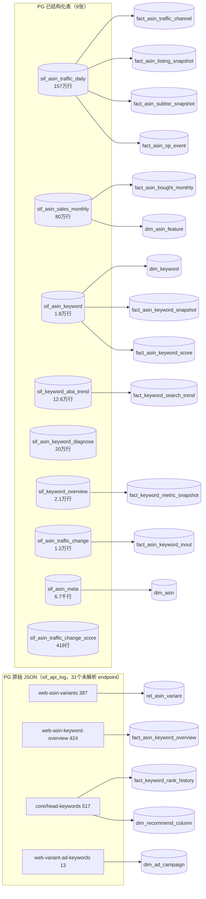

**两张表值得单独注意**

| PG 表 | 喂几张 Doris 表 | 含义 |
|---|---:|---|
| `sif_asin_traffic_daily` | **4** | 体量最大（157 万行）且一对多，ETL 应**一次扫表分四路写出** |
| `sif_asin_sales_monthly` | **2** | `dim_asin_feature` 是它的副产品，不是独立抓取 |

**PG 有数据但 Doris 无落点（schema 缺表/缺列）**

| PG 数据 | 量 | 为什么落不下去 | 建议 |
|---|---:|---|---|
| ~~ABA 转化漏斗指标~~ | — | ✅ **已建表并灌数** | `fact_keyword_conversion_funnel`，854 行，见 §补缺表 |
| ~~关键词竞争格局指标~~ | — | ✅ **已建表并灌数** | `fact_keyword_competition_snapshot`，3,244 行 |
| ~~节假日日历~~ | — | ✅ **已建表并灌数** | `dim_festival`，156 行 |
| **关键词 TOP ASIN 明细**（`web-keyword-conversion.data.keywords[].topAsins[]`） | **90,374 个元素**，`asin`/`img`/`title` 100%、`price` 90,369（99.99%） | `rel_keyword_top_asin` 只有 `rank_position` | 加 `img`/`title`/`price` 3 列 |
| `sif_asin_keyword_diagnose` | 202,866 行 | Doris 无「关键词归因诊断」表 | **它天然带 `granularity+period`**，可解模块 5 的历史回溯问题 |
| `sif_asin_traffic_change` 的 `kind='main'` | **3,698 行** | Doris 43 张表**无对应落点** | 带 `contri_change`/`change_reasons` 归因数据，需新建表 |
| 日粒度价格/评分/BSR（`traffic-trend` 的 `buyboxPrice[]`/`review[]`/`bsr[]`/`woot[]`） | **2,462/2,462 行 = 100%** 都带这些数组 | `fact_asin_listing_snapshot` 是**月粒度** | 日粒度被聚合掉，若要日趋势需扩表 |
| `sif_asin_traffic_change_score` | 418 行 | Doris 无 ASIN 级 7 口径变化率表 | 可补模块 6 的归因摘要 |
| `sif_asin_traffic_daily` 多列 | — | 4 张下游表都没接 | `woot`(86.2%)、`buybox_seller`(86.2%)、`seller`(86.5%)、`bought_past_month`(66.3%)、`deal_price`(86.1%) |

> 前两项是**真正的 schema 缺口**，不是 ETL 实现问题：数据在手上，但 Doris 没有地方放。
> 其中 `bought_past_month`(66.3%) 可能应落到 `fact_asin_bought_monthly`，需确认与 `sif_asin_sales_monthly` 的口径差异。

**PG 侧确证整列为空（0% 填充，下游勿依赖）**

| PG 列 | 是否爬虫 bug | 实测依据 |
|---|---|---|
| `sif_asin_traffic_daily.ad_id` | ❌ **不是** | 上游 `traffic-trend` 响应确实有 `adId` 键（2,442 条），但**数组元素全为 null**（含非 null 元素的响应数 = **0**）。同期 `campaignId` 有 2,270 条含真值——对比证明爬虫解析逻辑正确，是上游不给 |
| `sif_asin_traffic_daily.ld_price` | ❌ 不是 | 整列 0% |
| `sif_asin_traffic_change.search_volume_change_ratio` | ❌ 不是 | 整列 0% |

> 这三列已交叉验证过，**不要再花时间排查爬虫**。`ad_id` 的缺失直接导致广告域
> `dim_ad_product_ad` 只能依赖成功率 11.8% 的 `web-variant-ad-keywords`。

---

## 跨模块公共依赖

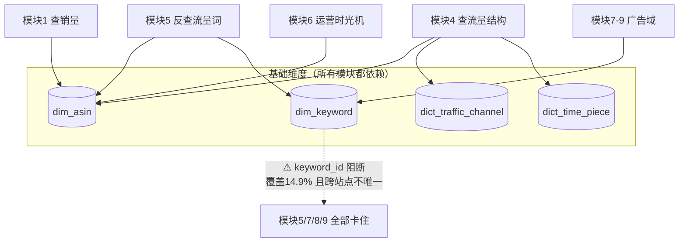

**先做 `dim_asin` 和 `dim_keyword`**——前者 6 个模块依赖，后者 4 个模块依赖。
其中 `dim_keyword` 的主键方案是**整个项目最高优先级的决策点**：不定，反查流量词 + 广告域共 4 个模块全部动不了。

---

## 建议开发顺序

按「能出成品」而非「表的编号」排：

| 批次 | 做什么 | 产出 | 前置条件 |
|---|---|---|---|
| **第 1 批** | 模块 1 查销量 | **一个完整可演示的页面** | 无，可立即开工 |
| **第 2 批** | **模块 2 多变体**（解析 `multiNfInfo`） | 14,694+4,325 行，两张表 | 写 JSON 解析 |
| 第 3 批 | 模块 4 查流量结构 + 模块 6 SQL2/SQL3 | 两个页面主干 | **需定月内聚合口径** |
| 第 4 批 | 解析 `web-sales-keyword` | 补 `dim_asin` 的 brand 等 4 列 | 写 JSON 解析 |
| 第 5 批 | 模块 3 推荐专栏 SQL1+SQL3 | 141 个专栏 + 1,002 行钻取 | 需自建 `short_code` 映射 + 多语言归一 |
| 第 6 批 | 模块 6 SQL1 事件 diff | 时光机完整（77,881 事件） | 实现 diff 算法 |
| 暂缓 | 模块 5 反查流量词 | — | **等 `keyword_id` + `channel` 两项裁决** |
| 暂缓 | 模块 7-9 广告域 | — | 先排查接口 88% 失败 |

**第 1 批排最前**：查销量是唯一「三条 SQL 全部有源且已在 Doris 实测跑通」的模块，
能最快产出可演示页面，也能把 ETL 链路先跑通一遍。

**第 2 批提前的原因**：`multiNfInfo` 有 76,469 行明细，是本次核实新发现的最大一块数据，
且 `keyword_id` 填充 100%（不受阻断项影响），性价比高于流量结构。

---

## 附：与 ETL_GAP_ANALYSIS 的对应关系

| 本文档 | ETL_GAP_ANALYSIS 对应章节 |
|---|---|
| 模块 1 SQL2 分档串问题 | §1.3 销量分档串丢失 |
| 模块 5 整体阻断 | §1.1 keyword_id 覆盖率 / §1.2 跨站点不唯一 |
| 模块 1 SQL1 的 6 个空列 | §3.1 dim_asin 字段 0% 实测 |
| 模块 4 渠道映射 | §2.1 渠道宽表→长表映射 |
| 模块 7-9 广告域 | §4.1 广告域 4 张表 |
| 模块 3 的 141 个专栏名 | §7 已探明推荐专栏（原记 18 个，已修正） |
| 第 3 批要解析的 endpoint | §8 31 个未结构化 endpoint（P0 四个） |
